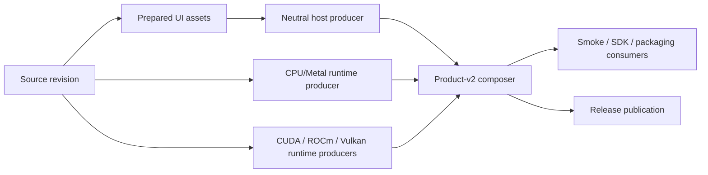

# Depot CI migration and build-graph plan

This document is the migration contract for moving MeshLLM's non-hardware CI
jobs to Depot while restructuring builds around immutable, reusable artifacts.
The implementation must optimize elapsed feedback time without allowing PR,
main, and release products to drift.

## Baseline and targets

Use [`scripts/collect-ci-metrics.py`](../scripts/collect-ci-metrics.py) and the
methodology in [`METRICS.md`](METRICS.md) for every before/after comparison.
The initial mixed-change-class baseline is recorded in
[`metrics/2026-07-29-pr-builds-baseline.json`](metrics/2026-07-29-pr-builds-baseline.json):

| Workflow/cohort | Sample | p50 wall | p95 wall | Maximum |
| --- | ---: | ---: | ---: | ---: |
| PR Builds, successful | 20 | 33m 12s | 55m 33s | 69m 01s |
| PR Builds, successful | 50 | 35m 00s | 82m 42s | 87m 00s |
| Main CI, successful | 50 | 34m 12s | 112m 42s | 125m 54s |
| PR Quality, successful | 30 | 12m 36s | 27m 30s | — |

The 20-run PR cohort's largest job-family p95 values were Windows CUDA
42m 09s, Windows ROCm 39m 23s, Windows CPU 32m 06s, and Swift SDK smoke
27m 12s. Swift finished last in 8 of those 20 runs. A representative full PR
run took 42m 12s; its Windows CPU row took 41m 30s. A representative main run
spent about 77 runner-minutes rebuilding the same Windows neutral host across
backend rows.

These numbers mix change classes. The rollout must compare like-for-like
cohorts and report queue time separately from execution time.

Target service levels:

| Signal | Target |
| --- | --- |
| PR routing/format signal | p95 under 2 minutes |
| Typical Rust PR required signal | p50 under 10 minutes, p95 under 20 minutes |
| Backend-affecting PR | p95 under 30 minutes |
| Main full composed-product graph | p95 under 45 minutes |
| Warm-cache no-op compile request | at least 80% sccache hit rate |
| Artifact consumer rebuilds | zero |

## Product graph

Every supported platform follows one graph:



The shared implementation primitives are:

- `.github/actions/prepare-host-input`: build one backend-neutral host, then
  attest when requested, import-check it, and write a checksum.
- `.github/actions/prepare-windows-host-input`: perform the same immutable host
  preparation for Windows debug/release profiles and include a prebuilt
  attestation verifier for release consumers.
- `.github/actions/prepare-native-runtime-input`: build/package exactly one
  runtime archive and run the release-grade runtime verifier.
- `.github/actions/compose-product-input`: checksum and verify producer inputs,
  compose product-v2 without compiling, and run client readiness.
- `.github/actions/restore-smoke-inputs`: safely extract a composed product,
  revalidate its manifest and bytes, and stage that exact host/runtime pair.
- `.github/actions/capture-sccache-stats`: retain per-job JSON counters for
  offline aggregation with `scripts/summarize-sccache-stats.py`.

`scripts/build-host.sh` is the only Unix host builder.
`scripts/build-release.sh` is a compatibility wrapper. Backend recipes and
workflows must never build a host as a side effect of producing a runtime.

Artifact contracts:

| Layer | Required contents | Mutation rule |
| --- | --- | --- |
| Host input | executable, `.sha256`, `host-imports.json`; release adds attestation | immutable after checksum |
| Runtime input | runtime directory, archive, archive checksum, `manifest.json` | immutable after verification |
| Product input | host, host imports, `product-manifest.json`, one `native-runtimes/<id>` | composer never compiles |
| Static ABI input | checksummed, target-described CPU llama link closure keyed by patch queue, pinned build-image epoch, and recipe | one producer per target; tests and native SDK rows verify and restore without fallback builds |

PR artifacts are unstamped, retained for one day, and cannot be promoted into a
release. Main and release exercise the same actions; release adds version
preparation, signing, public packaging, and publication around them.

## PR, main, and release policy

PRs optimize for the earliest reliable signal:

- route from changed files before compiling consistency checks;
- run formatting directly on a standard runner instead of pulling the large
  backend image;
- build one Linux host and one CPU runtime independently only when an inference
  artifact is needed, then compose them without compiling;
- build backend products only for ABI/backend inputs;
- use the debug profile for the ordinary PR CPU signal and the release profile
  for manual, benchmark, and backend-affecting runs;
- fan that one exact host artifact into the CPU and every selected backend
  runtime row;
- build or restore the static CPU llama ABI once per target, archive it, and fan
  those exact bytes into every crate-test, grouped-test, and native-SDK row
  instead of compiling the same C++ graph concurrently;
- run runner-image contract checks only when their workflow, cache version, or
  cache integration changes;
- make SDK smokes consume the staged product runtime and reject hidden rebuilds;
- keep public-mesh admission out of required PR checks. It remains an explicit
  manual integration probe, while product readiness uses hermetic local mDNS.
- gate fan-in jobs that must tolerate skipped dependencies with
  [`!cancelled()`](https://docs.github.com/en/actions/reference/workflows-and-actions/workflow-cancellation),
  never `always()`, so cancelling a superseded run releases its runner capacity.

Main is the exhaustive trust boundary:

- run all workspace crate-test batches;
- use the same single static-ABI producer/fan-out contract as PR builds;
- build one Linux release host on every non-doc main change;
- build CPU, CUDA, ROCm, and Vulkan runtime products from that host;
- run the longer integration and SDK consumers from uploaded product bytes;
- retain hardware qualification as a separate lane.

Release uses the same host/runtime/product actions. Signing and publishing are
release-only wrappers and never change the underlying compilation process.
The first Depot release phase routes only a `workflow_dispatch` from `main`:
Linux x86 CPU native SDK/runtime producers, compile-only ROCm/Vulkan runtime
producers, and Linux product composers. Tag-triggered releases, metadata,
publishing, attested host producers, inference jobs carrying `HF_TOKEN`,
macOS, Windows, ARM, and hardware-qualified GPU work stay on their existing
runners. The attested host cannot move until unsigned compilation and
GitHub-hosted signing are separate jobs.

## Depot runner rollout

Depot runners are selected with a single label such as
`depot-ubuntu-24.04-8`. MeshLLM uses:

| Workload | Initial label | Reason |
| --- | --- | --- |
| routing, summaries, CLI docs | `depot-ubuntu-24.04` or `-4` | short, low-memory |
| format and UI quality | `depot-ubuntu-24.04-4` | avoid backend image pull |
| Rust check/test/clippy and unsigned host builds | `depot-ubuntu-24.04-8` | CPU-bound compile |
| runtime builds without hardware execution | `depot-ubuntu-24.04-8` | CPU/I/O-bound C++ build |
| measured high-parallelism runtime builds | `depot-ubuntu-24.04-16` | compare wall time, peak disk, and cost before adopting |
| hardware-qualified CUDA tests | dedicated GPU runner | requires a real device |

The current top-level runner selector has one effective repository gate:

- `DEPOT_RUNNERS_ENABLED=true` enables eligible trusted `main` push and
  `main`-ref dispatch jobs. Tag pushes and every other ref remain hosted.
- Every `pull_request` event selects GitHub-hosted runners, even for a
  same-repository branch and even if `DEPOT_PR_RUNNERS_ENABLED` is set.
  `DEPOT_PR_RUNNERS_ENABLED` is ignored while automatic Depot Cache is enabled.

Trusted `workflow_dispatch` runs accept `use_depot=true` for a bounded canary,
but the selector requires `github.ref == 'refs/heads/main'`. The manual input is
never authority to run feature-branch code on Depot. The selector emits one
typed cache permission from the same decision, so a caller cannot select a
hosted runner while independently enabling Depot WebDAV.

Runner-owning reusable workflows require an additional boundary. A PR can call
the main-pinned `native-sdk-artifact.yml` or `static-abi-artifact.yml` while the
called workflow checks out PR contents, so neither workflow accepts
caller-provided `runs_on` or `allow_depot_remote_cache` inputs. A fixed
`ubuntu-24.04` policy job validates a bounded size enum (`default`, `4`, `8`,
`16`), maps the requested target architecture to checked-in labels, and emits
both the build runner and cache permission. Depot is selected only when the
caller context is the exact `Mesh-LLM/mesh-llm` repository, a `push` or
`workflow_dispatch` on `refs/heads/main`, and
`DEPOT_RUNNERS_ENABLED == 'true'`. Every PR event, tag, feature ref, external
repository, macOS target, or disabled gate without the authorized canary
receives a GitHub-hosted label and cache permission false. For the pre-variable
canary, the protected workflow may also read `use_depot == 'true'` from the
immutable `workflow_dispatch` event payload, but only the same exact
repository/main/dispatch guards can authorize it; no reusable-workflow input
can grant that authority.

This selector is defense in depth, not the primary security boundary. The
current pull-request workflows and repository-local actions are evaluated from
PR-controlled code, so a pull request can modify or bypass the selector itself.
Consequently, repository variables and same-repository comparisons cannot make
the current PR workflow safe for Depot.

Activation prerequisites:

1. The Depot GitHub Apps remain connected to `Mesh-LLM`.
2. Protect `main` with an enforceable review/ruleset gate for runner-owning
   workflow changes. The current repository ruleset prevents deletion,
   non-fast-forward updates, and non-linear history, but does not require a
   pull request, review, or successful CI check. An exact-main workflow
   allowlist is not a durable privilege boundary while an unreviewed direct
   push can replace that workflow.
3. With organization-admin authority, verify that GitHub's `Default` runner
   group is restricted to `Mesh-LLM/mesh-llm` and exact protected
   default-branch workflow refs. Public-repository allocation is operational,
   but the current token cannot inspect the administrative policy.
4. If either restriction is absent, restrict the group immediately before any
   further rollout. Depot-managed ephemeral runners register in that group.
5. The cold/warm `depot-canary.yml` pair from `refs/heads/main` is complete:
   runs
   [30525111329](https://github.com/Mesh-LLM/mesh-llm/actions/runs/30525111329)
   and
   [30525247727](https://github.com/Mesh-LLM/mesh-llm/actions/runs/30525247727)
   passed all six labels. The
   workflow fails closed unless Depot injects its WebDAV endpoint,
   authentication, and runner-image identity. It compiles a deterministic
   no-checkout probe through sccache and rejects WebDAV read/write errors; the
   warm pass requires both sccache and Actions cache hits. Verify all four Intel
   runner sizes, both ARM runner sizes, and their reported architectures
   without printing credentials.
6. The denied feature-ref
   [run 30593657371](https://github.com/Mesh-LLM/mesh-llm/actions/runs/30593657371)
   concluded skipped without allocating a Depot runner. Its temporary ref
   pointed exactly at main SHA
   `851888d0b0ce19916d6b0d7d73ce49246eef67d6` and was removed after inspection.
7. Add exact default-branch workflow refs only as their phase starts. Reusable
   workflows whose jobs run on Depot must be listed separately, must derive
   runner placement from immutable caller context inside the protected
   workflow, and must never pass a caller-provided label to `runs-on`.
8. Set `DEPOT_RUNNERS_ENABLED=true` only after the administrative trust
   boundary is verified and comparable trusted canaries meet the rollout
   targets. Live inspection on 2026-08-02 found it set to `true` even though
   the administrative boundary remains unverified with the available token;
   an organization administrator must confirm that boundary.

The initial main allowlist is:

```text
Mesh-LLM/mesh-llm/.github/workflows/ci.yml@refs/heads/main
Mesh-LLM/mesh-llm/.github/workflows/pr_quality.yml@refs/heads/main
Mesh-LLM/mesh-llm/.github/workflows/depot-registry-canary.yml@refs/heads/main
Mesh-LLM/mesh-llm/.github/workflows/native-sdk-artifact.yml@refs/heads/main
Mesh-LLM/mesh-llm/.github/workflows/static-abi-artifact.yml@refs/heads/main
```

`hf-download-smoke.yml`, `smoke.yml`, `scripted-binary-smoke.yml`, and
`sdk-smoke.yml` may receive model credentials from trusted callers and
intentionally allocate only bounded GitHub-hosted labels. They are not selected
for the Depot group. The Swift SDK producer is likewise fixed to
GitHub-hosted `macos-15` instead of accepting a runner input. This keeps a pull
request from invoking a
default-branch reusable workflow with a privileged Depot or dedicated-runner
label.

Pull-request callers do not pass `HF_TOKEN` to these workflows at all; public
fixtures and merge-ref-scoped model caches provide the PR signal without
exposing a repository secret to checked-out PR code. Trusted main and release
callers may pass the optional token for rate-limit resilience, but those
credential-bearing invocations remain GitHub-hosted.

Add `pr_builds.yml@refs/heads/main` only for its trusted manual benchmark and
`release.yml@refs/heads/main` only for the non-publishing release phase. Never
select a feature ref, `refs/pull/*`, or “all workflows.”

Depot PR execution is intentionally out of the current rollout. Automatic
Depot Cache injects repository-scoped cache authority into the whole job, with
no branch isolation. A default-branch-pinned reusable workflow and separate
cache-key conventions cannot stop malicious checked-out PR code from using
that authority directly. PR code may run on Depot only after automatic cache
injection is disabled and complete token/API isolation is proven, or after
Depot provides a comparably strong per-PR cache boundary. Until then, required
and optional PR-event jobs remain GitHub-hosted; `pr_builds.yml` can be
benchmarked only by a trusted manual dispatch from `main`.

Do not use `pull_request_target` to build or execute PR content. A
default-branch-pinned reusable workflow preserves the normal `pull_request`
event while keeping the runner-owning workflow definition trusted.

The Depot dashboard reports the `Mesh-LLM` GitHub connection active with
automatic Depot Cache and registry authentication enabled. GitHub's
organization installation API lists `depot-managed-runners` and
`depot-code-access` for all repositories. Main-ref dispatches on this public
repository now allocate ephemeral Depot runners, superseding the 2026-07-29
observation that public access was disabled. The available token currently gets
403 when reading organization runner-group settings, so the exact live
repository/workflow restrictions remain administratively unverified. Re-check
them with organization-admin authority. The
separate `mesh-llm` group owns two dedicated GPU scale sets and is not the Depot
group.

The bounded evidence is:

- cold and warm `depot-canary.yml` runs
  [30525111329](https://github.com/Mesh-LLM/mesh-llm/actions/runs/30525111329)
  and
  [30525247727](https://github.com/Mesh-LLM/mesh-llm/actions/runs/30525247727)
  passed all six Intel/ARM runner labels;
- denied feature-ref
  [30593657371](https://github.com/Mesh-LLM/mesh-llm/actions/runs/30593657371)
  was skipped before runner allocation, and its main-identical temporary ref
  was removed;
- exhaustive prerelease
  [30586470043](https://github.com/Mesh-LLM/mesh-llm/actions/runs/30586470043)
  passed all 55 executed jobs, including 15 Depot jobs across those labels, and
  published the complete `v0.75.0-rc1` immutable artifact graph;
- warm non-GPU release canary
  [30590595090](https://github.com/Mesh-LLM/mesh-llm/actions/runs/30590595090)
  finished with 36 successes, 28 intentional skips, and zero failures. Nine
  jobs allocated ephemeral Depot runners; both static-ABI producers restored
  exact cache entries without compiling, and both Linux native-SDK consumers
  reported roughly 95% sccache hits.

The canaries do not satisfy the trust prerequisite by themselves. Live
inspection on 2026-08-02 found `DEPOT_RUNNERS_ENABLED=true`, while `main` still
has no classic branch protection and the exact organization runner-group
allowlist remains unverified with the available token. Treat this as an
unresolved administrative risk, not evidence that the prerequisite is met.

Depot redirects every GitHub Actions cache API consumer on its runners,
including `actions/cache`, `actions/setup-node`, and third-party cache actions.
Its namespace is repository-scoped and is not isolated by branch. Therefore:

- current pull-request jobs never run on Depot and may use the normal
  `mesh-llm` key namespace in GitHub's native `actions/cache` because GitHub
  scopes PR writes to the merge ref and trusted main jobs do not restore from
  that ref. Their sccache backend is writable job-local disk only because the
  pinned sccache makes a mixed chain wholly read-only and records each miss as
  a rejected write;
  trusted main/release/warmers publish shared compiler-cache entries. The
  crate-test target shards deliberately restore the already-seeded
  `main-rust-crate-tests-<shard>` keys with writes disabled;
- a local sccache disk-only setting protects only that sccache child process;
  it does not remove the Depot token or prevent another cache API consumer
  from reading or poisoning the repository cache;
- no untrusted PR code may run on Depot while automatic cache injection is
  enabled;
- trusted main/release jobs may explicitly enable the `disk,webdav` chain and
  fall back to job-local disk.

GitHub-hosted trusted jobs retain the existing disk/GitHub Actions cache path.
PR sccache is job-local, while bulk Rust and exact native `actions/cache`
restores provide safe cross-run reuse under GitHub's merge-ref isolation.
Never print a cache token.

Relevant Depot documentation:

- [GitHub Actions runner overview](https://depot.dev/docs/github-actions/overview)
- [Runner quickstart](https://depot.dev/docs/github-actions/quickstart)
- [Runner types and sizes](https://depot.dev/docs/github-actions/runner-types)
- [GitHub Actions cache behavior](https://depot.dev/docs/cache/integrations/github-actions)
- [sccache integration](https://depot.dev/docs/cache/integrations/sccache)
- [Actions analytics](https://depot.dev/docs/github-actions/observability/github-actions-metrics)
- [GitHub runner-group selected-workflow API](https://docs.github.com/en/rest/actions/self-hosted-runner-groups?apiVersion=2022-11-28)
- [GitHub guidance for self-hosted runners in public repositories](https://docs.github.com/en/actions/how-tos/manage-runners/self-hosted-runners/manage-access)

## Cross-repository responsibilities

### `Mesh-LLM/mesh-llm-runner-images`

Runner images own stable tools and backend SDKs, not commit-specific products.
The first migration phase was merged in
[`mesh-llm-runner-images#9`](https://github.com/Mesh-LLM/mesh-llm-runner-images/pull/9):
PRs route only affected image families plus the mandatory public CPU AMD64
contract, never export BuildKit cache, and never stage or promote registry
content. Trusted main pushes stage candidates; weekly or explicit manual runs
promote a retained candidate cohort. The reusable family workflow independently
derives its runner/cache authority, verifies the source revision, identifies
candidate content by digest, and serially reconciles the complete `latest`
cohort. Deleted files participate in routing.

Merge commit `4e79e68e22a5ea9bb1eedf9a2a7e7ccfc20b2bca`
then passed the trusted main
[run 30522118156](https://github.com/Mesh-LLM/mesh-llm-runner-images/actions/runs/30522118156)
with 35 successful jobs, four intentional skips, and zero failures.

The subsequent role-isolation revision should:

1. build the UI once in a Node-capable producer and upload it before any
   Node-free host role starts; `public-rust-host` consumes those prepared UI
   bytes and contains Rust/Cargo/sccache, host libraries, CMake/Ninja, lld, and
   only Cargo dependency warming;
2. publish `public-native-cpu` with the CPU C/C++ toolchain and packaging tools,
   and separate `public-native-{cuda,rocm,vulkan}` roles with only the matching
   GPU SDK. None of these roles owns Rust, Node, pnpm, UI, website, or Python
   application dependencies;
3. publish `public-compose` with only Bash, Python standard library,
   tar/coreutils, required runtime libraries, and artifact verifiers.
   Composition jobs must not carry a backend compiler or SDK;
4. give every role its own verifier that asserts both required capabilities and
   forbidden tools/layers;
5. canary a pinned JavaScript action inside every public role as a job container
   on both GitHub-hosted and trusted Depot runners. This proves the Actions
   Node-external mount contract independently of whether the image ships Node;
6. make one content-addressed architecture base feed every backend overlay,
   and move source-revision provenance after dependency-warm layers;
7. build each architecture/role once, push it under an immutable staging
   digest, run the role verifier and canaries against that exact digest, then
   promote only the verified digest into multi-architecture manifests and
   human-facing tags. Promotion must not invoke another image build;
8. add `self-hosted-*` Actions-runner/device overlays only after all public
   roles pass. Keep the runner agent out of public builder and composition
   images;
9. gate updates on retained compressed-size and controlled cold-pull
   measurements.

The latest measured publication evidence is
[runner-images run 30248081255](https://github.com/Mesh-LLM/mesh-llm-runner-images/actions/runs/30248081255).
It completed 55 jobs in 39m 15s. Its slowest initial `Build and verify test
image` step took 14m 25s, then the later publication pass rebuilt the public
ROCm 7.2 AMD64 image in an 18m 03s `Build and push architecture image by
digest` step. This demonstrates duplicate test/publish image construction; it
does not measure image size, cold-pull time, or cache effectiveness.

The hardened build-once PR graph is measured by
[runner-images run 30504335079](https://github.com/Mesh-LLM/mesh-llm-runner-images/actions/runs/30504335079).
Because the PR changed the Dockerfile, the affected-family planner correctly
selected all 20 platform rows. All 22 allocated jobs stayed GitHub-hosted,
completed in 6m 22s wall and 1h 13m 07s aggregate, and emitted no real cache
export phase. Compared with the first build-once run's 22m 57s wall and
2h 52m 59s aggregate, that is a 72.3% wall reduction and 57.7% aggregate
reduction. The slowest self-hosted ROCm 7.2 row fell from 22m 20s to 5m 48s.
This validates read-only PR cache and change routing. Trusted main staging then
passed in run 30522118156 above; retained-cohort promotion remains a separate
scheduled/manual operational gate.

No retained audit evidence currently substantiates the previously cited
1.53 GB/1.92 GB compressed sizes or backend cold-initialization medians, so
those values are not migration baselines. The following are provisional design
budgets, not measurements: at most 1.0 GB for `public-rust-host`, 500 MB for a
CPU native builder, 250 MB and 20s cold-pull p50 for `public-compose`, at least
1 GB removed from each backend image, and publication under 25 minutes. Record
per-platform compressed bytes and controlled cold-pull samples before enforcing
or revising any of these gates.

GHCR remains canonical. After the split, a trusted Depot canary may compare a
Depot Registry pull-through reference and the containerd layer store against
the exact same GHCR index/child digests. Adopt either only with at least 20%
and 10 seconds of median pull improvement; never expose the registry or cache
token to PR code.

The checked-in `depot-registry-canary.yml` implements that measurement gate for
any digest-pinned public base or runner image. Configure each upstream
repository as a distinct Depot pull-through repository, set the nonsecret
`DEPOT_REGISTRY_HOST` repository variable, and enable Depot's native Actions-job
Registry access for the organization. Depot pre-authenticates each trusted
ephemeral runner with a short-lived job credential, so no stored registry secret
or workflow-minted pull token is required. Run the workflow from `main` with the
exact upstream digest and relative Depot repository name. It allocates five
fresh ephemeral runners per source, verifies the injected Depot organization
identity and digest identity, retains raw timing observations for 14 days, and
reports whether both thresholds pass. Do not enable a mirror in normal builds
until its own retained cohort passes.

### `Mesh-LLM/mesh-packaging`

Merged
[`mesh-packaging#16`](https://github.com/Mesh-LLM/mesh-packaging/pull/16)
completed the packaging conversion at merge commit
`76c619bcdd82773e159248a2282187b0b2973daa`. It consumes the immutable
product-v2 release index and upstream Node addon artifacts without rebuilding
the CLI, runtime, or addons. Typed native, Homebrew, and npm selectors fail
closed; publication still requires each complete release validation set.

Each selected row now restores and re-verifies the exact upstream product,
produces and installs one native package, builds one final image from
digest-resolved bases, tests that exact image, and records immutable package,
product, host, runtime, base-image, upstream, and source identities. Trusted
publication stages by digest and promotes the tested digest without rebuilding;
an existing identical immutable tag is a no-op and a mismatch fails closed.
Dry runs have read-only repository permissions and no registry login or push.

The first successful complete product-v2 baseline is
[run 30593548823](https://github.com/Mesh-LLM/mesh-packaging/actions/runs/30593548823)
at PR head `ffd240c099d38dc1e16cb252f30b347a6d835399`. It completed in
37m 10s with 41 successful jobs, 15 intentional publication-only skips, and
zero failures. It validated all 11 native package rows, exact local final
images, package installation, deterministic client readiness, Homebrew, all
five upstream Node addon lanes, prerelease npm assembly, host invariants, and
immutable release evidence against MeshLLM `v0.75.0-rc1`. No package, image,
npm artifact, release asset, or production tag was published.

The merged default branch then passed
[Packaging Precheck 30595367445](https://github.com/Mesh-LLM/mesh-packaging/actions/runs/30595367445)
at the merge commit. Eligible packaging rows remain GitHub-hosted until the
same Depot runner-group trust boundary required by the main repository is
administratively verified and separately rolled out.

## Measurement and rollout gates

For each phase, save raw observations and label them with provider, runner size,
image digest, and change class:

```bash
python3 scripts/collect-ci-metrics.py \
  --repo Mesh-LLM/mesh-llm \
  --workflow ci.yml \
  --branch main \
  --event push \
  --limit 5 \
  --label provider=depot \
  --label runner=depot-ubuntu-24.04-8 \
  --raw-out /tmp/main-depot-runs.json \
  --json-out /tmp/main-depot-metrics.json \
  --markdown-out /tmp/main-depot-metrics.md
```

Rollout sequence:

1. require pull requests and review for changes to `main`, with runner-owning
   workflow changes covered by the enforceable repository ruleset;
2. restrict the persistent `mesh-llm` GPU runner group to protected workflow
   entry points before scheduling untrusted public-repository workflows on
   those devices;
3. verify with organization-admin authority that the Depot-backed `Default`
   runner group is restricted to this repository and exact protected
   default-branch workflow refs; correct it immediately if not;
4. retain the completed allowed-main cold/warm and denied-feature-ref evidence;
5. compare `-4`, `-8`, and `-16` using Depot CPU/memory/disk utilization data;
6. allowlist main CI plus only the hardened reusable producers that directly
   allocate Depot runners, then canary routing, quality, and the Linux product
   graph from `main`; keep credential-bearing smoke workflows GitHub-hosted;
7. collect five comparable green main canaries;
8. set `DEPOT_RUNNERS_ENABLED=true` for trusted main jobs after those canaries
   meet the targets;
9. allowlist `release.yml@refs/heads/main` and exercise the non-publishing,
   non-secret runtime/composition producers. Tag-push publishing remains hosted;
10. keep all PR-event code hosted while automatic Depot Cache is enabled;
11. retain the completed packaging conversion and product-v2 rehearsal
    evidence; route any eligible packaging rows to Depot only through a
    separately reviewed trust rollout.

Rollback for the currently implemented trusted lanes is one
repository-variable change:

```bash
gh variable set DEPOT_RUNNERS_ENABLED --repo Mesh-LLM/mesh-llm --body false
```

`DEPOT_PR_RUNNERS_ENABLED` does not activate Depot in the current PR workflows.
Leave it unset or `false`; any later PR phase requires automatic-cache
isolation plus its own explicit rollback control before activation.

Disabling Depot changes runner placement only. It must not change the build
graph, action inputs, cache keys, or artifact contracts.
