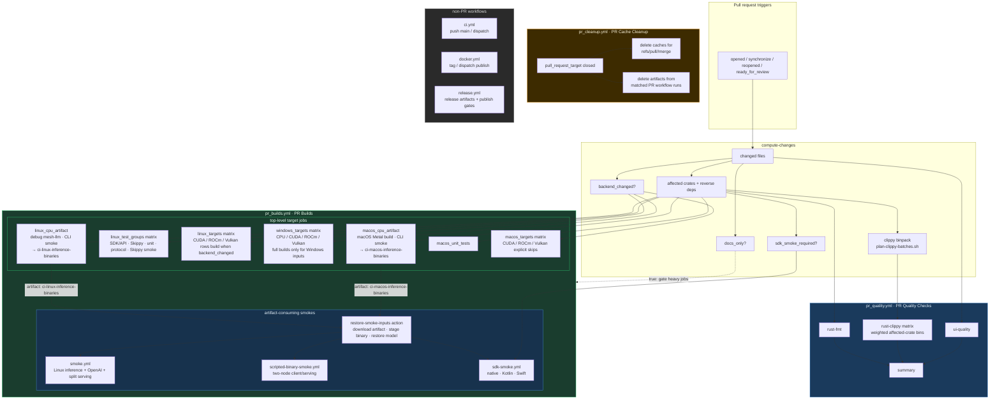

## Current PR Builds contract

- `pr_quality.yml` is named **PR Quality Checks** and owns the earliest feedback:
  formatting, UI quality when relevant, and deterministic clippy bins from
  `scripts/plan-clippy-batches.sh`.
- `pr_builds.yml` is named **PR Builds** and owns PR target jobs plus integration
  and smoke validation. Linux and macOS CPU artifact jobs upload the binaries
  that downstream smoke jobs consume before long validation groups finish;
  Linux test groups run SDK/API, Skippy, unit, protocol, and Skippy smoke work
  as parallel matrix rows. Linux/macOS backend matrices remain separate from the
  CPU artifact producers.
- Workflow/orchestration-only PR edits validate the PR routing graph without
  becoming Rust crate changes. They must not fan out into Linux/macOS artifact
  producers, native backend, Windows GPU, benchmark, or SDK-smoke lanes unless a
  changed file also affects Rust crates, UI assets, SDK inputs, or backend
  products. Backend lanes are reserved for files that can affect native
  ABI/backend products, such as `third_party/llama.cpp/**`,
  `crates/skippy-ffi/**`, backend build scripts, `Justfile`, and
  `.github/cache-version.txt`.
- Windows target jobs use the `windows_cpu` and `windows_gpu` filters for full
  platform builds. The CPU row can still run lightweight Windows cargo checks
  for broad Rust changes, but CUDA/ROCm/Vulkan rows stay skipped unless Windows
  GPU inputs changed or the workflow is manually dispatched.
- `pr_cleanup.yml` deletes PR merge-ref caches and artifacts from positively
  matched PR workflow runs when a pull request closes. Cleanup-only workflow
  edits do not fan out into Rust/build/smoke jobs.
- Docker image validation and publishing are intentionally not part of pull
  request CI; non-PR workflows (`ci.yml`, `docker.yml`, `release.yml`) own main,
  dispatch, tag, and release-grade publishing behavior.

## Artifact and smoke reuse

- Smoke jobs restore binaries through `.github/actions/restore-smoke-inputs` and
  reusable workflows instead of rebuilding `mesh-llm` or patched llama.cpp.
- Linux CPU artifacts feed inference, two-node, native SDK, and Kotlin SDK
  smokes. macOS CPU artifacts feed Swift SDK smokes.
- Artifact-consuming smokes are additionally gated on the matching CPU producer
  being eligible, so backend-only or cleanup-only PRs skip those jobs natively
  instead of attempting to download an artifact that was never uploaded.
- PR and smoke-only CI artifacts use `retention-days: 1`; PR cleanup removes
  matched PR-run artifacts proactively.
- Direct `mesh-llm` invocations in workflows and CI scripts must include
  `--log-format json`.

## PR CI performance heuristics

Use these checks when reviewing PR CI wall-clock regressions:

- **Critical path minutes**: compare the first job start to the last required job
  finish, then identify the longest required job. Workflow/orchestration-only
  changes should complete after routing validation instead of being dominated by
  Linux/macOS artifacts, Windows, backend, or SDK smoke jobs.
- **Heavy-lane eligibility**: every expensive backend/platform lane should be
  traceable to `backend_changed`, `windows_cpu`, `windows_gpu`, or
  `sdk_smoke_required`. If a workflow/doc-only edit triggers CUDA, ROCm, Vulkan,
  Windows release builds, or Swift/Kotlin SDK smokes, routing is too broad.
- **Duplicate work count**: smoke jobs should consume uploaded Linux/macOS
  binaries through `.github/actions/restore-smoke-inputs`; they should not build
  `mesh-llm` or patched llama.cpp again.
- **Prewarmed ABI cache hit ratio**: Windows ABI cache keys in PR Builds must
  match the trusted `windows-warm-caches.yml` keys. Check
  `gh cache list --branch main --limit 100` for
  `mesh-llm-windows-2022-skippy-abi-*` entries before
  treating a slow Windows miss as expected.
- **Runner routing**: platform-specific work should run on its native runner
  class (`windows-2022` for Windows ABI products, macOS for Swift/Metal, Linux
  for Linux backends) and skip unsupported combinations explicitly.

For agent-facing workflow editing rules, see `.github/AGENTS.md`.
