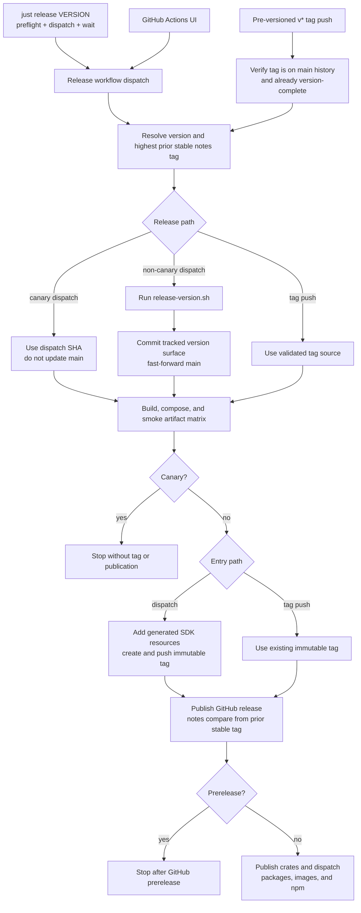
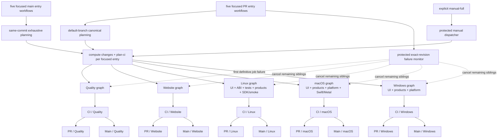

# MeshLLM CI topology

This is the checked-in implementation. Normative rules live in
`.agents/skills/manage-ci/SKILL.md`; the factual inventory is in
`.agents/skills/manage-ci/references/current-inventory.md`; the design record
and acceptance criteria are in `.omo/specs/pr-ci-optimization.md`.

## Entry points

| Workflow | Trigger | Role |
| --- | --- | --- |
| `pr_quality.yml` (`PR · Quality`) | `pull_request` | Plans and calls the protected Quality lane |
| `pr_website.yml` (`PR · Website`) | `pull_request` | Plans and calls the protected Website lane |
| `pr_linux.yml` (`PR · Linux`) | `pull_request` | Plans and calls the protected Linux lane |
| `pr_macos.yml` (`PR · macOS`) | `pull_request` | Plans and calls the protected macOS lane |
| `pr_windows.yml` (`PR · Windows`) | `pull_request` | Plans and calls the protected Windows lane |
| `pr-cancel-sibling-runs.yml` (`PR · Cancel sibling lanes`) | protected `workflow_run` for `PR · Quality` | Watches one exact PR revision and cancels its other validation lanes after the first job failure |
| `pr_builds.yml` | `workflow_call` only | Inert compatibility for the pre-migration protected runner-contract filename check |
| `ci-orchestrator.yml` | `workflow_call` only | Inert compatibility for the pre-migration protected runner-contract filename check |
| `main_quality.yml` (`Main · Quality`) | push to `main` | Plans and calls the same-commit Quality lane |
| `main_website.yml` (`Main · Website`) | push to `main` | Plans and calls the same-commit Website lane |
| `main_linux.yml` (`Main · Linux`) | push to `main` | Plans and calls the same-commit Linux lane |
| `main_macos.yml` (`Main · macOS`) | push to `main` | Plans and calls the same-commit macOS lane |
| `main_windows.yml` (`Main · Windows`) | push to `main` | Plans and calls the same-commit Windows lane |
| `ci.yml` | `workflow_call` only | Inert compatibility for the former main ingress filename |
| `ci-control.yml` (`CI · Manual Full`) | `workflow_dispatch` on `main` | Explicit operator-only full plan, detached lane dispatch, and correlated diagnostic checks |
| `ci-*-lane.yml` | `workflow_call`, `workflow_dispatch` | Composable Quality, Website, Linux, macOS and Windows graphs |
| `llama-upstream-canary.yml` | daily schedule, dispatch | Trusted default-branch llama.cpp bump certification on the self-hosted `family-certify` runner. It never runs as ordinary push or PR CI. `scripts/plan-family-battery.py` validates the versioned `ci/llama-canary/family-certified.json` policy and every file's exact immutable cache blob identity and byte size before native compilation. Each target/draft artifact must have at least one metadata-bearing GGUF shard; every shard that carries architecture dimensions must match the declared runtime range and activation width, including Qwen4's `hyper_connection.count * embedding_length` boundary. Optional `mmproj_artifact` rows pin a projector GGUF sidecar (exact blob identity, exempt from trunk-dimension checks), and each family that pins one runs an additional multimodal smoke lane after its core lanes: the real-projector + deterministic-image harness in `crates/skippy-server/src/frontend/tests/multimodal.rs` (local monolithic and split stages) via `SKIPPY_MM_*`, reconciled against the plan like every other lane. It emits deterministic bounded matrix shards and records the plan with evidence. The current single-runner workflow consumes one all-family shard, builds the certification binaries once, then runs the full supported-family battery. Before any lane starts, the battery verifies shard/tensor scans, declared runtime/MTP layer counts, model bytes, disk headroom and certification ports, and runs a one-token MTP speculative-corpus smoke. Only GGUFs with a complete native MTP/NextN tensor head across all shards run `llama-spec-bench`; every certified profile must retain strict `single-step`, `chain`, and `state-handoff` parity. Single-step and chain exercise the sole shipping raw-f32 activation wire and any mismatch is a hard failure. Planned families, sweep cuts, and multimodal smokes are reconciled exactly against executed lanes and recorded results. Declared per-model or model-size-derived startup deadlines, complete-certification wall-clock limits and typed lane outcomes are recorded, and immutable plans/model manifests/preflight evidence/certification logs upload even on failure. Manual dispatch can force this certification when the upstream SHA is unchanged. Persistent-runner execution is always a read-only checkout of trusted `main`; patch-apply failures and certification-lane failures route through the agent repair loop (`scripts/llama-canary-agent-repair.sh`), which produces a repair PR on `llama-canary/patch-queue-fix` for human review — the canary run stays red until that PR merges. After a successful changed-pin battery, a separate GitHub-hosted write-only job commits on the exact certified `main` SHA and fails safely if `main` advanced. Runner reads its pre-warmed HF cache over NFS (`HF_CACHE` + `HF_HUB_OFFLINE=1` in the runner `.env`; no `flock` on NFS, so the runner never downloads) |

Each PR entry checks out the default branch for canonical planning, projects
only its matching bounded lane, and invokes that lane at `@main` as a nested
reusable workflow. GitHub therefore exposes five focused PR-associated runs
with direct job and step drill-down. Each has a stable `PR / <lane>` result.
The entries receive no repository secrets and independently cancel superseded
synchronizations. Eligible same-repository executor jobs may select Depot
through protected runner policy while the bounded repository gate is active;
forks and control-plane jobs remain hosted.
The protected planner action extracts only `ci/ownership.yml` and
`ci/slices.yml` from the validated immutable PR source SHA into a unique
runner-temp directory. The source ownership and slice catalogs must match the
protected catalogs, preventing PR-controlled routing, matrix, or worker
expansion. These files are routing data, not executable code.
Planner code, Cargo workspace discovery, and affected-crate operations still
run from the protected default-branch checkout. A missing or non-regular source
manifest fails the plan.

Because the catalogs must match byte for byte, a branch cannot introduce its
own ownership or slice entry and pass its own Plan gate. Catalog evolution is a
sequenced maintainer merge, not an escape hatch: land a catalog-only commit on
the default branch that registers the new paths or slices, then rebase the
dependent branch onto it so both copies match again. Do not relax the compare
to unblock a branch — the byte-identical check is the boundary that keeps
PR-controlled routing out of the protected planner.

### Required PR shape and visibility

The five-way split is a hard CI architecture invariant. Keep exactly these PR
validation entry workflows: Quality, Website, Linux, macOS, and Windows. PR
metadata, cleanup, auto-assignment, and sibling-cancellation workflows such as
`pr_cleanup.yml`, `pr_auto_assign.yml`, and `pr-cancel-sibling-runs.yml` are
outside this validation census. Every validation
workflow must call only its matching protected reusable lane and finish with
its own stable `PR / <lane>` result. Add or refactor jobs inside the owning
reusable lane; do not move multiple lanes into a shared PR entrypoint.

Workflow visibility is part of correctness. From a PR's Checks or Actions UI,
a reviewer must see five focused workflow runs and be able to drill directly
into each lane's nested jobs and logs. A controller check that only says
`dispatched`, with the real work detached into separate runs, is not acceptable.
Neither is a single PR run containing the combined Quality, Website, Linux,
macOS, and Windows graph: that recreates the monolithic matrix and makes the
platform/topic boundary unusable in review.

Do not add path filters to these entrypoints. They all start for each relevant
PR synchronization so their stable results exist; the canonical plan suppresses
unselected expensive work inside each run. Do not reintroduce
`ci-orchestrator.yml` as an orchestrator or add another all-lanes PR composer.
Its temporary reusable-only migration shim has no event trigger or lane calls
and should be deleted with `pr_builds.yml` after the post-merge runner contract
is active on the protected default branch.

### Required main shape and visibility

Routine main validation uses the same five-way split: Quality, Website, Linux,
macOS, and Windows. Each `main_*.yml` entrypoint plans the exhaustive main
profile at the pushed SHA, calls only its matching same-commit reusable lane,
and finishes with `Main / <lane>`. This keeps every job and log directly
drillable from a focused main workflow run while ensuring the workflow
definition and implementation are from the commit being validated.

Do not funnel main pushes through `ci-control.yml`, dispatch the real jobs into
detached runs, or build one monolithic main graph. Do not add path filters or
supersession cancellation: main is exhaustive evidence and every pushed
revision must retain its five terminal results. `ci-control.yml` is reserved
for a maintainer's explicit default-branch manual-full diagnostic run. That
operator-selected path may use detached dispatch and the synthetic
`CI Required` aggregate; routine main never does.

The temporary `ci.yml` reusable-only shim has no push trigger, dispatcher, or
lane calls. It can be removed with the other migration shims after the updated
runner contract is active on protected main.

### Release source and version ownership

`scripts/release-version.sh` is the single owner of the tracked release-version
surface. On a non-canary `release.yml` dispatch, the metadata job applies that
script, creates a linear release-source commit when needed, and fast-forwards
`main` before the build graph begins. `just release` only performs local
preflight, dispatches that workflow, and waits for its result. A tag push must
already be reachable from `main` and version-complete; the metadata job applies
the same script and rejects any tracked diff. Canary dispatches do not mutate
`main` or publish.

The later publish job checks out the canonical source commit, adds only the
generated SwiftPM/binding and SDK console resources needed by the immutable
release tag, publishes the assets, and enables GitHub-generated release notes.
The metadata job selects the highest stable `vMAJOR.MINOR.PATCH` tag below the
target as the explicit comparison base. It excludes every prerelease tag, so
release candidates and their final stable release use the same stable baseline;
the final notes retain the RC changes and add any post-RC changes.
The workflow-scoped token push does not fan out another main CI run; the release
graph is the evidence for that version-only source commit.


```mermaid
flowchart TD
    JUST["just release VERSION<br/>preflight + dispatch + wait"] --> DISPATCH["Release workflow dispatch"]
    UI["GitHub Actions UI"] --> DISPATCH
    TAG["Pre-versioned v* tag push"] --> VERIFY["Verify tag is on main history<br/>and already version-complete"]
    DISPATCH --> META["Resolve version and highest prior stable notes tag"]
    VERIFY --> META
    META --> PATH{"Release path"}
    PATH -- "canary dispatch" --> CANARY["Use dispatch SHA<br/>do not update main"]
    PATH -- "non-canary dispatch" --> BUMP["Run release-version.sh"]
    BUMP --> VERSION_COMMIT["Commit tracked version surface<br/>fast-forward main"]
    PATH -- "tag push" --> TAG_SOURCE["Use validated tag source"]
    CANARY --> BUILD["Build, compose, and smoke artifact matrix"]
    VERSION_COMMIT --> BUILD
    TAG_SOURCE --> BUILD
    BUILD --> PUBLISHABLE{"Canary?"}
    PUBLISHABLE -- "yes" --> CANARY_DONE["Stop without tag or publication"]
    PUBLISHABLE -- "no" --> TAG_PATH{"Entry path"}
    TAG_PATH -- "dispatch" --> PREPARE_TAG["Add generated SDK resources<br/>create and push immutable tag"]
    TAG_PATH -- "tag push" --> EXISTING_TAG["Use existing immutable tag"]
    PREPARE_TAG --> RELEASE["Publish GitHub release<br/>notes compare from prior stable tag"]
    EXISTING_TAG --> RELEASE
    RELEASE --> KIND{"Prerelease?"}
    KIND -- "yes" --> RC_DONE["Stop after GitHub prerelease"]
    KIND -- "no" --> DOWNSTREAM["Publish crates and dispatch<br/>packages, images, and npm"]
```

## Graph shape


```mermaid
flowchart TD
    PR["five focused PR entry workflows"] --> PRPLAN["default-branch canonical planning"]
    MAIN["five focused main entry workflows"] --> MAINPLAN["same-commit exhaustive planning"]
    MANUAL["explicit manual-full"] --> CONTROL["protected manual dispatcher"]
    PRPLAN --> PLAN["compute changes + plan-ci per focused entry"]
    PR --> MONITOR["protected exact-revision failure monitor"]
    MAINPLAN --> PLAN
    CONTROL --> PLAN
    PLAN --> QUALITY["Quality graph"]
    PLAN --> WEB["Website graph"]
    PLAN --> LINUX["Linux graph\nUI + ABI + tests + products + SDK/smoke"]
    PLAN --> MAC["macOS graph\nUI + products + platform + Swift/Metal"]
    PLAN --> WIN["Windows graph\nUI + products + platform"]
    QUALITY --> QC["CI / Quality"]
    WEB --> WC["CI / Website"]
    LINUX --> LC["CI / Linux"]
    MAC --> MC["CI / macOS"]
    WIN --> XC["CI / Windows"]
    QC --> GATE["PR / Quality"]
    WC --> WEBGATE["PR / Website"]
    LC --> LINUXGATE["PR / Linux"]
    MC --> MACGATE["PR / macOS"]
    XC --> WINGATE["PR / Windows"]
    MONITOR -. "first definitive job failure" .-> QUALITY
    MONITOR -. "cancel remaining siblings" .-> WEB
    MONITOR -. "cancel remaining siblings" .-> LINUX
    MONITOR -. "cancel remaining siblings" .-> MAC
    MONITOR -. "cancel remaining siblings" .-> WIN
    QC --> MQ["Main / Quality"]
    WC --> MW["Main / Website"]
    LC --> ML["Main / Linux"]
    MC --> MM["Main / macOS"]
    XC --> MX["Main / Windows"]
```

Each lane uses a platform-local static superset of typed reusable-workflow
calls; `if` conditions consume only its checked planner projection. PR lanes
are nested in five topic/platform PR runs; routine main lanes are nested in
the matching five main runs; manual-full alone uses separate dispatched run
IDs correlated by source SHA and plan digest. Linux
graphs contain no macOS/Windows placeholder jobs, and the converse holds for
the other platforms. Protected manual control uses the Actions API only
for a closed list of five checked-in workflow files and passes data through
native inputs. No workflow YAML is generated and no lane allocates a planner.

## Planner and profiles

`scripts/plan-ci.py` is the only source of slice eligibility. It reads the
JSON-compatible YAML manifests `ci/ownership.yml` and `ci/slices.yml`, validates
their schema and dependency graph, and emits `ci/ci-plan.schema.json` output.
Its optional manifest root changes only those two reads. All workspace and
Cargo operations use the planner's workspace root. PR callers pass the
runner-temp source-manifest root; push and manual callers use
`GITHUB_WORKSPACE`.
Each plan contains source/base identities, direct crates, affected crates,
semantic domains, signals, selected slices, reasons, typed matrices, runner
roles, cache modes and fan-out budgets. Unknown paths and malformed inputs fail
closed.

Control-plane changes fail open through the selected profile. When they
require the `web` slice, both console and website rows execute even without a
content-specific change signal, so the stable gate receives a successful
required slice instead of an empty reusable workflow reported as skipped.

Profiles are closed and event-derived:

| Profile | Selection |
| --- | --- |
| `pr-draft` | No build slices; stable planner/gate results only (CI-control and runner-infrastructure changes still fail open) |
| `pr-ready` | Complete targeted rows for directly owned domains and affected Rust dependents |
| `main` | All workspace, product, platform, backend, smoke and SDK rows |
| `manual-full` | Main-equivalent non-publishing validation on dispatch |

The selected ready-PR row uses the same build commands, profile semantics,
artifact contract and verification as the corresponding main row. Draft PRs
select no build rows. Trust-derived placement, cache mode, artifact namespace
and optional credentials may differ, along with row selection and bounded
parallelism.

## Slice catalog

The five lane workflows organize the catalog without changing selected rows:
`ci-quality-lane.yml`, `ci-website-lane.yml`, `ci-linux-lane.yml`,
`ci-macos-lane.yml`, and `ci-windows-lane.yml`. Platform lanes keep each host,
runtime, composition and smoke dependency chain inside one run, so native
runtime producers are not duplicated.

- `ci-quality-slice.yml` — action/packaging/consistency contracts, format,
  bounded Clippy batches and CLI documentation synchronization.
- `ci-web-slice.yml` — console lint/type/test, console Playwright E2E, and
  public website build.
- `ci-ui-artifact-slice.yml` — one immutable console `dist` producer.
- `static-abi-artifact.yml` — one verified portable static llama ABI producer
  that exports the exact toolchain epoch recorded in its artifact.
- `ci-rust-tests-slice.yml` — deterministic affected or all-workspace Cargo
  test batches consuming the static ABI artifact and its producer-owned
  toolchain epoch. Batches that exercise Skippy correctness tests restore an
  exact revision- and SHA-256-pinned model cache, verify the file before use,
  and leave publication to one trusted-main batch.
- `ci-{linux,macos,windows}-host-slice.yml` — one platform-pure neutral host
  producer consuming that lane's immutable UI distribution.
- `ci-{linux,macos,windows}-runtime-slice.yml` — platform-pure native runtime
  producers selected by backend rows.
- `ci-{linux,macos,windows}-product-slice.yml` — composition-only consumers
  that join only their matching immutable host and runtime artifacts.
- `ci-platform-checks-slice.yml` — macOS portable/unit, Windows portable, and
  focused Windows log-store privacy ACL checks.
- `ci-linux-product-smoke-slice.yml` and
  `ci-macos-product-smoke-slice.yml` — platform-local CPU core, CUDA,
  two-node, Metal and model-download consumers using only composed artifacts.
  CUDA inference uses the
  approved `gpu-nvidia` ephemeral self-hosted scale set, including for
  same-repository PRs. That hardware-qualified exception executes only through
  protected default-branch reusable workflows, receives no repository secrets or
  credential-bearing caches, and is restricted to the repository's GPU runner
  group. Its PR runtime is compiled for both sm86 and sm120 because the scale
  set currently contains RTX 3080 and RTX 5090 workers. The smoke installs the
  pinned CUDA 12.9 user-space runtime libraries required by the host-linked
  product before inference.
  ROCm and Vulkan products remain package-verified until eligible inference
  runners are registered.
- `ci-linux-sdk-slice.yml` and `ci-macos-sdk-slice.yml` — platform-local
  Rust, Kotlin and Swift consumers. Swift production starts from the plan and
  Kotlin production from the shared static ABI; only smoke consumers wait for
  the matching product lane.
- `ci-runner-contract-slice.yml` — plan/provider/PR cache-boundary checks and
  trusted-main runner-image contracts.

Lower-level producers (`native-sdk-artifact.yml`, `swift-sdk-artifact.yml`) and
consumers (`smoke.yml`, `scripted-binary-smoke.yml`, `sdk-smoke.yml`,
`hf-download-smoke.yml`) remain reusable building blocks.

## Fan-out and timing controls

The planner records profile budgets: PR drafts/ready runs allow at most
7 Linux, 2 macOS, 1 Windows matrix workers and 10 planned workers overall;
main/manual runs allow 12, 4, 2 and 18 respectively. Each matrix also sets
`max-parallel`, and backend/platform rows are selected by ownership rather than
by a blanket PR fan-out. Host, ABI and runtime producers remain unique per
selected row. The readability tradeoff is one UI artifact build per active
platform workflow because artifacts are run-scoped; UI tests still execute
only in the Website graph and host producers never rebuild the UI themselves.

Timing evidence is collected read-only with `scripts/collect-ci-metrics.py`.
Schema-v3 reports keep workflow wall/queue, runner queue, dependency wait,
execution, runner-minutes, cancelled runner-minutes and peak workers separate,
and group results by provider, OS, architecture, semantic runner role and
Depot size. When `--compare-input` is supplied, the report always emits a
`comparison` block. Its recommendation is `hold` when job families or
provider sets are not comparable. Deterministic queue p95 and
capacity-contamination heuristics emit `eligible`, `hold`, `rollback` or
`insufficient_sample`; they are rollout signals, not dated conclusions. Keep
raw inputs and dated reports under `/tmp` or a tracking artifact, never in
`ci/`.

### PR failure domains

The five PR workflows remain separate visible checks, but they share a PR-only
failure budget. A protected `workflow_run` monitor starts when `PR · Quality`
enters progress and polls the five validation runs associated with the same PR
number, exact head SHA, and two-minute event epoch. When it observes the first
definitive failed, timed-out, startup-failed, stale, or action-required job, it
preserves that workflow as the root diagnostic and cancels the other queued or
in-progress lane runs. Each triggering Quality run owns a distinct monitor, so
a newer synchronization cannot prevent an older exact-revision monitor from
finishing its bounded cleanup.

The monitor executes only the default-branch implementation, checks out only
the default branch, and owns the narrowly scoped `actions: write` token.
PR-controlled entrypoints, reusable executors, and checked-out source never
receive that permission. Main, manual-full, release, deployment, cleanup,
cache-warming, unrelated workflows, other PRs, and a different event epoch are
not cancellation targets. The monitor costs one GitHub-hosted Linux slot while
the PR runs; this bounded overhead replaces five per-lane polling jobs and is
expected to recover more capacity whenever a lane fails early.

Inside Linux, macOS, and Windows, PR-only `fail_fast` inputs are enabled for
Rust-test, host, native-runtime, product, and platform-check matrices. The
first required failure cancels queued and in-progress siblings in that matrix.
Main and manual-full pass `false` so exhaustive runs retain complete backend
and platform diagnostics. Quality's Clippy matrix also remains non-fail-fast:
quality failures are independent findings and never make a product producer
unusable.

Producer/consumer `needs` edges are the second cancellation layer. A failed UI,
ABI, host, or runtime producer prevents its product and smoke consumers from
starting. Only the protected monitor may use the Actions API for cross-workflow
cancellation. The failed workflow is never cancelled, so its stable summary
can report the precise terminal failure; cancelled siblings are expected
terminal results that release their runner capacity.

## Artifact contract

Every product has three immutable layers:

1. prepared UI assets;
2. a release-profile backend-neutral host per OS/architecture;
3. one native runtime per OS/architecture/backend.

`compose-product-input` verifies checksums, manifests and host import policy,
then composes exact producer bytes without compiling or substituting inputs.
Smoke and SDK consumers download those artifacts and never rebuild a missing
producer. PR and smoke artifacts retain for one day; caches are acceleration,
not correctness contracts.

Runtime and product artifact IDs preserve every compatibility discriminator:
`ci-runtime-<platform>-<architecture>-<backend>` and
`ci-product-<platform>-<architecture>-<backend>`. Consumers download the exact
platform, architecture, and backend identity selected by the plan.

Release-profile hosts are used for both selected PR rows and main rows. Besides
keeping product semantics identical, this prevents unstripped debug binaries
from being duplicated into every composed product artifact.

## Provider and cache policy

`.github/actions/select-ci-runners` maps semantic roles to approved labels.
Fork pull requests use GitHub-hosted runners. Eligible same-repository PRs may
use Depot while the repository-wide gate and time-bounded cache-risk exception
in `ci/DEPOT_PR_RISK_EXCEPTION.md` are active. The
other exception is uncredentialed CUDA smoke on the approved ephemeral
`gpu-nvidia` scale set described above. PRs use the same protected reusable
lanes and receive no repository secrets. On routine trusted-`main` pushes,
Linux roles may use Depot only when `DEPOT_RUNNERS_ENABLED` is exactly `true`;
macOS, Windows, credential-bearing smokes and other hardware-qualified work
retain explicit approved placement. The same-repository PR exception may also
select eligible build/test rows on Depot macOS 15 and
Windows 2022, subject to the same policy and documented exceptions. Provider
choice never changes plan membership, commands, artifacts, tests or summaries.

Depot coverage is reported against the selected ordinary-executor denominator,
not against every job in the Actions run. For a plan, the denominator is every
ordinary build/test executor row that the same event, trust profile, platform,
architecture and policy make eligible for Depot; the numerator is the subset
that actually receives a `depot-*` label. Control-plane planning,
runner/selector diagnostics and lane summaries are outside the denominator;
credential-bearing smokes, `gpu-nvidia` hardware, and unsupported or Intel
macOS rows without a Depot-equivalent remain documented provider exceptions
and are reported separately. Therefore “100% Depot” means 100% of eligible
ordinary executor rows, not that every check or job is hosted by Depot.

The central selector normally makes the Depot cache namespace inert by emitting
`allow_native_github_cache=false` and `allow_depot_remote_cache=false`. During
the bounded exception, eligible same-repository PR and trusted-main Depot jobs
emit `allow_native_github_cache=true`, enabling intentional
cross-branch reuse through Depot's repository-wide Actions-cache proxy. Direct
Depot build-tool remote cache remains disabled. This is a conscious iteration-
speed tradeoff and the shared cache is treated as attacker-controlled input,
not a correctness or authority boundary. Hosted release and cache-warmer
workflows retain their existing GitHub cache behavior.

The admin-verified organization switches have a narrower meaning than that
consumer policy: disabling automatic Depot Cache and Registry Actions
connectivity removes the direct `DEPOT_CACHE_TOKEN`/WebDAV build-tool
preconfiguration and Registry Actions authentication from fresh runners. It
does not document or enforce a per-connection/job/ref disable or ACL for the
GitHub Actions cache proxy/runtime-token path. The controlled sentinel proved
that this path remains repository-scoped and crosses the trusted-main/PR
boundary, so switch state is not an isolation proof.

The selector also accepts the optional repository variable
`DEPOT_PR_CANARY_REF`. When it is absent (the default), no canary PR is
selected and the normal global `DEPOT_PR_RUNNERS_ENABLED` gate is unchanged.
When it contains one exact `refs/pull/<number>/merge` ref, that same-
repository PR merge ref is an additive canary path; fork heads,
`pull_request_target`, dispatches and planner-forced hosted paths still remain
hosted. The canary gate never grants remote Depot cache permission and does not
replace the global PR gate. Maintainers must not set it until the external
isolation protocol proves the actual Depot/WebDAV and Actions-cache authority
boundary.

The ordinary PR selector requires the independent global gate. Forks and
CI-policy changes remain hosted, and the source-enforced exception expires on
2026-09-14 UTC. GitHub's `all_external_contributors` approval policy covers
external contributors, not same-repository collaborator branches; the global
gate and checked-in expiry are therefore the maintainer approval control.

The Quality slice also contains a separate, additive authority-sentinel
selector. It reads `DEPOT_PR_SENTINEL_REF` (not `DEPOT_PR_CANARY_REF`) and
emits a separate runner/depot decision used only by the no-checkout
`authority_sentinel` diagnostic job. The ordinary Quality jobs continue to use
the existing `runner_policy` outputs, so this hook cannot change their provider
or the normal plan/build graph. The job is eligible only for the exact
same-repository `pull_request` merge ref with
`original_event_name=pull_request`; a global `DEPOT_PR_RUNNERS_ENABLED=true`
value alone is insufficient. Forks, target/dispatch events, force-hosted
signals, missing/non-matching refs and malformed refs remain hosted/no-Depot
(malformed selector configuration is rejected by the central selector).

This diagnostic exception intentionally skips `audit-depot-pr-isolation`: the
audit rejects the ambient non-GitHub endpoint before cache access, while the
sentinel must exercise the actual restore/save authority without checking out
PR code. It has empty permissions, no checkout or secrets, validates the
separate `DEPOT_PR_SENTINEL_ID` and actual PR number, restores the trusted seed
at `.depot-authority-sentinel`, and gates only after publication. Before any
cache action, it attests the provider-injected `ACTIONS_CACHE_URL` and
`ACTIONS_RESULTS_URL` as value-free structural HTTP endpoints with a nonempty
non-GitHub/non-loopback authority (including all IPv4 `127/8` and IPv4-mapped
IPv6 loopback spellings), numeric port and explicit path; malformed/missing
inputs fail closed without printing endpoint, host, path, port or token values.
The shell attestation intentionally does not inspect ambient
`ACTIONS_RUNTIME_TOKEN`: pinned `actions/cache` restore/save actions run as
Node actions; GitHub's `NodeScriptActionHandler` injects the runtime
credential, while the shell `ScriptHandler` does not. Successful full
restore/save calls are the credential/token proof. Endpoint authorities are
classified
with the fixed runner's Python 3.8+ stdlib `ipaddress` parser for all bracketed
IPv6 spellings; parser absence/version/invalidity fails closed. Seed and poison
markers are validated byte-for-byte on cache hits. After saving the PR poison,
the no-checkout job clears and fully restores that exact key, requires a cache
hit and exact bytes before the trusted-seed gate, and proves the same-job Node
token/write path; main verify's poison miss remains the cross-scope proof. It
is outside planner slices and does
not add build commands, matrices, artifacts, or producer/consumer edges; the
existing Quality lane summary still gates on its normal `quality` and
`runner_contract` jobs. Fork PRs remain hosted and provide the
no-Depot-authority evidence.

The intended PR-Depot end state preserves the same five entry workflows and
matching protected lane calls. After the external cache and runner-group gates
in `ci/DEPOT_MIGRATION.md` are proven, provider policy may select ephemeral
Depot for eligible build/test jobs in Linux, macOS 15 and Windows 2022 lanes
where an equivalent image/architecture exists. This is not a direct label
swap: a PR can edit checked-out workflows/actions, and Depot's automatic
cache/registry authority is repository-scoped unless administrators prove a
per-PR boundary. The owning protected workflow must remain pinned to the
reviewed default branch, derive provider and cache mode from the event/trust
policy, receive no PR secrets or registry/cache tokens, and check out the
immutable PR SHA. Control-plane planning/required summaries, credential-
bearing smokes, `gpu-nvidia` hardware work, and any Intel macOS row without a
Depot-equivalent remain on their approved providers.

### PR cache audit and rerun behavior

GitHub-hosted PR runs may restore caches from their PR merge ref and the base
branch. A cache written by a `pull_request` run is scoped to that PR merge ref,
so it is reusable by later runs of the same PR but not by main or another PR.
The implemented policy uses that isolation selectively:

| Cache class | PR publication | Effective rerun behavior |
| --- | --- | --- |
| Linux sccache compiler objects | Exact trusted 2 GiB seed plus job-local writes on GitHub-hosted jobs | Main Quality completion owns publication; PRs mutate only their ephemeral copy |
| Linux Cargo `target` directories | Disabled for Clippy, Rust tests, host, and runtime | Avoids sharded multi-GiB generations and their restore/upload latency |
| Skippy correctness model | Restore-only for PRs; one exhaustive trusted-main Rust-test batch publishes an exact file-SHA/cache-version key | Every consuming batch verifies the pinned Qwen file SHA-256; denied-cache runners download the immutable revision without publishing |
| Static Linux ABI and Swift native ABI | Exact PR-scoped cache on miss | Same-PR reruns reuse the verified native input when its full recipe/toolchain key is unchanged |
| macOS Metal unit ABI and Windows native ABI | Exact PR-scoped cache on miss | Same-PR reruns avoid the native rebuild; no restore prefixes cross an ABI boundary |
| Console pnpm store | None -- `ui_quality`, `ui_e2e`, and `ui_artifact` all point `store-dir` at the runner image's baked pnpm store instead of an Actions cache | Every run installs warm from the image; no cache to publish, restore, or race |
| Website npm store | None -- the `website` job runs in the prebuilt `public web` image (baked npm/node) with no bare-metal row, so its `setup-node` cache was deleted outright rather than kept | Every run does a fresh `npm ci`; no cache to invalidate or race |
| GitHub artifacts | Never used as cross-run caches | Immutable producers/consumers remain correct within one run; reruns recreate run-scoped artifacts |

Outside the bounded exception, a Depot-selected run emits
`allow_native_github_cache=false` and `allow_depot_remote_cache=false`. Every
native GitHub cache consumer in the
eligible five-lane build graph (explicit `actions/cache`, setup-node package
caches, rust-cache, static/Metal/Windows/Swift ABI caches, and Windows SDK
cache toggles) is then skipped or disabled; the installation and build steps
still run and regenerate on a miss. Hosted PRs and trusted hosted
main/release/manual paths retain the existing cache behavior. This is a
checked-in consumer policy, not proof that a Depot runner has no ambient
Depot/WebDAV authority.

For an eligible exception run, `allow_native_github_cache=true` enables those
guarded cache consumers on both selected PR and eligible trusted-main Depot
jobs. Depot's lack of branch isolation means the cache can cross the PR, main,
and other-PR trust boundaries. That accepted risk, including the exact sentinel
evidence and rollback procedure, is documented in
`ci/DEPOT_PR_RISK_EXCEPTION.md`; the exact-SHA canary, metrics, and hosted
rollback evidence are recorded in `.omo/specs/depot-pr-rollout-evidence.md`.

This is intentionally not a universal PR write-through policy. One protected
GitHub-hosted warmer publishes an exact-key compiler seed capped at 2 GiB after
successful Main Quality. Central runner policy denies that seed to every Depot
selection because Depot's Actions-cache proxy crosses trust scopes. Seeded
jobs enforce measured hit-rate floors only after an exact warm restore; a
missing seed is explicitly cold and does not fail. The seed key fingerprints
the warmer container image and toolchain epoch; runtime rows whose image or
epoch differs from the warmer are explicitly cold and skip seed restoration.
These four high-fanout job families also disable the per-object GHA backend on
every provider. Small exact native
caches have substantially better reuse-to-storage value. Cache hits are always
an optimization: native stamps/manifests/checksums are verified, and every job
must still regenerate successfully after a miss.

Permanent Depot PR execution is not yet approved. The bounded exception permits
eligible same-repository PR jobs through 2026-09-14 UTC. A protected
runner-group check, no-secret/no-direct-token execution, provider-isolation
redesign, and a new successful non-secret sentinel remain prerequisites for
removing that deadline. Do not change Depot settings or runner groups in a
workflow refactor.

The external administrative posture now has automatic Depot Cache and Registry
Actions connectivity disabled and the Depot runner group restricted to this
repository and its exact protected workflow refs. The switches remove the
direct Depot build-tool/registry credential path (including automatic
`DEPOT_CACHE_TOKEN`/WebDAV preconfiguration), but do not disable or isolate the
GitHub Actions cache proxy/runtime-token path. The controlled trusted-main
seed [run 31816775585](https://github.com/Mesh-LLM/mesh-llm/actions/runs/31816775585)
at `main` commit `9e977e246` succeeded. The same-repository PR authority sentinel
[run 31816869128 / job 94821057215](https://github.com/Mesh-LLM/mesh-llm/actions/runs/31816869128/job/94821057215),
read and exactly validated the trusted seed, published and exactly validated
the poison marker, and then failed its intended seed-isolation gate; the
enclosing PR run was later cancelled during cleanup. Trusted-main verify
[run 31817111471 / job 94821343605](https://github.com/Mesh-LLM/mesh-llm/actions/runs/31817111471/job/94821343605)
restored and exactly validated that poison and failed its intended expected-
miss gate. This proves unsafe
repository-scoped cross-trust authority. It is the basis of the explicitly
accepted temporary risk, not evidence of isolation. Permanent enablement still
requires a provider-isolation redesign and a new successful sentinel.

The exact-SHA five-lane candidate, provider-separated comparison, and
identical-SHA hosted rollback are recorded in
`.omo/specs/depot-pr-rollout-evidence.md`. Quality and Linux had favorable
queue observations but remain unclassified because execution was
cache-confounded; Website had insufficient samples, and macOS/Windows hit the
deterministic capacity rollback threshold. The fork PR canary and namespace
purge/expiry confirmation remain pending; permanent placement still requires
a successful post-redesign isolation sentinel and acceptable capacity
evidence.

## Required extension pattern

1. Read the manage-ci skill, inventory, this file and the optimization spec.
2. Classify the owner: planner, slice, runner/cache policy, producer,
   consumer, release or deployment.
3. Add or extend one typed reusable slice; do not copy a job into an entrypoint.
4. Add ownership and dependency rules to the manifests when routing changes.
5. Preserve immutable producer reachability and add the top-level call to its
   lane summary; update the controller projection if lane membership changes.
6. Keep provider and cache decisions in the central policy action.
7. Run the validation contract and update the inventory/spec status in the
   same change.

Minimum CI-definition validation:

```bash
just ci-validate
```

Use `just ci-shellcheck <changed-script>...` when shell sources change. Planner
fixtures and repository-consistency checks are included in `just ci-validate`;
the narrower `just ci-crate-lists`, `just check-release`, and
`just publish-crates` recipes remain available while iterating. Follow the
complete
[manage-ci validation contract](../.agents/skills/manage-ci/SKILL.md#validation-contract)
for scope-specific checks, and run the canonical `just test-all` target when
full repository validation is required.
