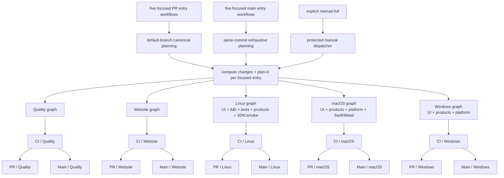

# MeshLLM CI topology

This is the checked-in implementation. Normative rules live in
`.agents/skills/manage-ci/SKILL.md`; the factual inventory is in
`.agents/skills/manage-ci/references/current-inventory.md`; the design record
and acceptance criteria are in `.omo/specs/pr-ci-optimization.md`.

## Entry points

| Workflow | Trigger | Role |
| --- | --- | --- |
| `pr_quality.yml` (`PR · Quality`) | `pull_request` | Plans and calls the protected Quality lane |
| `pr_website.yml` (`PR · Website`) | `pull_request` | Plans and calls the protected Website lane |
| `pr_linux.yml` (`PR · Linux`) | `pull_request` | Plans and calls the protected Linux lane |
| `pr_macos.yml` (`PR · macOS`) | `pull_request` | Plans and calls the protected macOS lane |
| `pr_windows.yml` (`PR · Windows`) | `pull_request` | Plans and calls the protected Windows lane |
| `pr_builds.yml` | `workflow_call` only | Inert compatibility for the pre-migration protected runner-contract filename check |
| `ci-orchestrator.yml` | `workflow_call` only | Inert compatibility for the pre-migration protected runner-contract filename check |
| `main_quality.yml` (`Main · Quality`) | push to `main` | Plans and calls the same-commit Quality lane |
| `main_website.yml` (`Main · Website`) | push to `main` | Plans and calls the same-commit Website lane |
| `main_linux.yml` (`Main · Linux`) | push to `main` | Plans and calls the same-commit Linux lane |
| `main_macos.yml` (`Main · macOS`) | push to `main` | Plans and calls the same-commit macOS lane |
| `main_windows.yml` (`Main · Windows`) | push to `main` | Plans and calls the same-commit Windows lane |
| `ci.yml` | `workflow_call` only | Inert compatibility for the former main ingress filename |
| `ci-control.yml` (`CI · Manual Full`) | `workflow_dispatch` on `main` | Explicit operator-only full plan, detached lane dispatch, and correlated diagnostic checks |
| `ci-*-lane.yml` | `workflow_call`, `workflow_dispatch` | Composable Quality, Website, Linux, macOS and Windows graphs |

Each PR entry checks out the default branch for canonical planning, projects
only its matching bounded lane, and invokes that lane at `@main` as a nested
reusable workflow. GitHub therefore exposes five focused PR-associated runs
with direct job and step drill-down. Each has a stable `PR / <lane>` result.
The entries receive no repository secrets, cannot select Depot or publish
trusted-main caches, and independently cancel superseded synchronizations.

### Required PR shape and visibility

The five-way split is a hard CI architecture invariant. Keep exactly these PR
validation entry workflows: Quality, Website, Linux, macOS, and Windows. PR
metadata, cleanup, and auto-assignment workflows such as `pr_cleanup.yml` and
`pr_auto_assign.yml` are outside this validation census. Every validation
workflow must call only its matching protected reusable lane and finish with
its own stable `PR / <lane>` result. Add or refactor jobs inside the owning
reusable lane; do not move multiple lanes into a shared PR entrypoint.

Workflow visibility is part of correctness. From a PR's Checks or Actions UI,
a reviewer must see five focused workflow runs and be able to drill directly
into each lane's nested jobs and logs. A controller check that only says
`dispatched`, with the real work detached into separate runs, is not acceptable.
Neither is a single PR run containing the combined Quality, Website, Linux,
macOS, and Windows graph: that recreates the monolithic matrix and makes the
platform/topic boundary unusable in review.

Do not add path filters to these entrypoints. They all start for each relevant
PR synchronization so their stable results exist; the canonical plan suppresses
unselected expensive work inside each run. Do not reintroduce
`ci-orchestrator.yml` as an orchestrator or add another all-lanes PR composer.
Its temporary reusable-only migration shim has no event trigger or lane calls
and should be deleted with `pr_builds.yml` after the post-merge runner contract
is active on the protected default branch.

### Required main shape and visibility

Routine main validation uses the same five-way split: Quality, Website, Linux,
macOS, and Windows. Each `main_*.yml` entrypoint plans the exhaustive main
profile at the pushed SHA, calls only its matching same-commit reusable lane,
and finishes with `Main / <lane>`. This keeps every job and log directly
drillable from a focused main workflow run while ensuring the workflow
definition and implementation are from the commit being validated.

Do not funnel main pushes through `ci-control.yml`, dispatch the real jobs into
detached runs, or build one monolithic main graph. Do not add path filters or
supersession cancellation: main is exhaustive evidence and every pushed
revision must retain its five terminal results. `ci-control.yml` is reserved
for a maintainer's explicit default-branch manual-full diagnostic run. That
operator-selected path may use detached dispatch and the synthetic
`CI Required` aggregate; routine main never does.

The temporary `ci.yml` reusable-only shim has no push trigger, dispatcher, or
lane calls. It can be removed with the other migration shims after the updated
runner contract is active on protected main.

## Graph shape


```mermaid
flowchart TD
    PR["five focused PR entry workflows"] --> PRPLAN["default-branch canonical planning"]
    MAIN["five focused main entry workflows"] --> MAINPLAN["same-commit exhaustive planning"]
    MANUAL["explicit manual-full"] --> CONTROL["protected manual dispatcher"]
    PRPLAN --> PLAN["compute changes + plan-ci per focused entry"]
    MAINPLAN --> PLAN
    CONTROL --> PLAN
    PLAN --> QUALITY["Quality graph"]
    PLAN --> WEB["Website graph"]
    PLAN --> LINUX["Linux graph\nUI + ABI + tests + products + SDK/smoke"]
    PLAN --> MAC["macOS graph\nUI + products + platform + Swift/Metal"]
    PLAN --> WIN["Windows graph\nUI + products + platform"]
    QUALITY --> QC["CI / Quality"]
    WEB --> WC["CI / Website"]
    LINUX --> LC["CI / Linux"]
    MAC --> MC["CI / macOS"]
    WIN --> XC["CI / Windows"]
    QC --> GATE["PR / Quality"]
    WC --> WEBGATE["PR / Website"]
    LC --> LINUXGATE["PR / Linux"]
    MC --> MACGATE["PR / macOS"]
    XC --> WINGATE["PR / Windows"]
    QC --> MQ["Main / Quality"]
    WC --> MW["Main / Website"]
    LC --> ML["Main / Linux"]
    MC --> MM["Main / macOS"]
    XC --> MX["Main / Windows"]
```

Each lane uses a platform-local static superset of typed reusable-workflow
calls; `if` conditions consume only its checked planner projection. PR lanes
are nested in five topic/platform PR runs; routine main lanes are nested in
the matching five main runs; manual-full alone uses separate dispatched run
IDs correlated by source SHA and plan digest. Linux
graphs contain no macOS/Windows placeholder jobs, and the converse holds for
the other platforms. Protected manual control uses the Actions API only
for a closed list of five checked-in workflow files and passes data through
native inputs. No workflow YAML is generated and no lane allocates a planner.

## Planner and profiles

`scripts/plan-ci.py` is the only source of slice eligibility. It reads the
JSON-compatible YAML manifests `ci/ownership.yml` and `ci/slices.yml`, validates
their schema and dependency graph, and emits `ci/ci-plan.schema.json` output.
Each plan contains source/base identities, direct crates, affected crates,
semantic domains, signals, selected slices, reasons, typed matrices, runner
roles, cache modes and fan-out budgets. Unknown paths and malformed inputs fail
closed.

Control-plane changes fail open through the selected profile. When they
require the `web` slice, both console and website rows execute even without a
content-specific change signal, so the stable gate receives a successful
required slice instead of an empty reusable workflow reported as skipped.

Profiles are closed and event-derived:

| Profile | Selection |
| --- | --- |
| `pr-draft` | Quality plus the smallest useful affected signal; core smoke is the only smoke row |
| `pr-ready` | Complete targeted rows for directly owned domains and affected Rust dependents |
| `main` | All workspace, product, platform, backend, smoke and SDK rows |
| `manual-full` | Main-equivalent non-publishing validation on dispatch |

The selected PR row uses the same build commands, profile semantics, artifact
contract and verification as the corresponding main row. Trust-derived
placement, cache mode, artifact namespace and optional credentials may differ,
along with row selection and bounded parallelism.

## Slice catalog

The five lane workflows organize the catalog without changing selected rows:
`ci-quality-lane.yml`, `ci-website-lane.yml`, `ci-linux-lane.yml`,
`ci-macos-lane.yml`, and `ci-windows-lane.yml`. Platform lanes keep each host,
runtime, composition and smoke dependency chain inside one run, so native
runtime producers are not duplicated.

- `ci-quality-slice.yml` — action/packaging/consistency contracts, format,
  bounded Clippy batches and CLI documentation synchronization.
- `ci-web-slice.yml` — console lint/type/test and public website build.
- `ci-ui-artifact-slice.yml` — one immutable console `dist` producer.
- `static-abi-artifact.yml` — one verified portable static llama ABI producer
  that exports the exact toolchain epoch recorded in its artifact.
- `ci-rust-tests-slice.yml` — deterministic affected or all-workspace Cargo
  test batches consuming the static ABI artifact and its producer-owned
  toolchain epoch.
- `ci-{linux,macos,windows}-host-slice.yml` — one platform-pure neutral host
  producer consuming that lane's immutable UI distribution.
- `ci-{linux,macos,windows}-runtime-slice.yml` — platform-pure native runtime
  producers selected by backend rows.
- `ci-{linux,macos,windows}-product-slice.yml` — composition-only consumers
  that join only their matching immutable host and runtime artifacts.
- `ci-platform-checks-slice.yml` — macOS portable/unit, Windows portable, and
  focused Windows log-store privacy ACL checks.
- `ci-linux-product-smoke-slice.yml` and
  `ci-macos-product-smoke-slice.yml` — platform-local CPU core, CUDA,
  two-node, Metal and model-download consumers using only composed artifacts.
  CUDA inference uses the
  approved `gpu-nvidia` ephemeral self-hosted scale set, including for
  same-repository PRs. That hardware-qualified exception executes only through
  protected default-branch reusable workflows, receives no repository secrets or
  credential-bearing caches, and is restricted to the repository's GPU runner
  group. Its PR runtime is compiled for both sm86 and sm120 because the scale
  set currently contains RTX 3080 and RTX 5090 workers. The smoke installs the
  pinned CUDA 12.9 user-space runtime libraries required by the host-linked
  product before inference.
  ROCm and Vulkan products remain package-verified until eligible inference
  runners are registered.
- `ci-linux-sdk-slice.yml` and `ci-macos-sdk-slice.yml` — platform-local
  Rust, Kotlin and Swift consumers. Swift production starts from the plan and
  Kotlin production from the shared static ABI; only smoke consumers wait for
  the matching product lane.
- `ci-runner-contract-slice.yml` — plan/provider/PR cache-boundary checks and
  trusted-main runner-image contracts.

Lower-level producers (`native-sdk-artifact.yml`, `swift-sdk-artifact.yml`) and
consumers (`smoke.yml`, `scripted-binary-smoke.yml`, `sdk-smoke.yml`,
`hf-download-smoke.yml`) remain reusable building blocks.

## Fan-out and timing controls

The planner records profile budgets: PR drafts/ready runs allow at most
7 Linux, 2 macOS, 1 Windows matrix workers and 10 planned workers overall;
main/manual runs allow 12, 4, 2 and 18 respectively. Each matrix also sets
`max-parallel`, and backend/platform rows are selected by ownership rather than
by a blanket PR fan-out. Host, ABI and runtime producers remain unique per
selected row. The readability tradeoff is one UI artifact build per active
platform workflow because artifacts are run-scoped; UI tests still execute
only in the Website graph and host producers never rebuild the UI themselves.

Timing evidence is collected read-only with `scripts/collect-ci-metrics.py`.
Do not put run-specific durations or historical conclusions in this document;
record an evidence file separately when a timing experiment is authorized.

### PR failure domains

The five PR workflows are independent failure domains. Quality and Website
continue when a platform compile or functional test fails, and platform lanes
do not cancel one another. This preserves useful, directly visible diagnostics
and prevents one topic from hiding another topic's result.

Inside Linux, macOS, and Windows, PR-only `fail_fast` inputs are enabled for
Rust-test, host, native-runtime, product, and platform-check matrices. The
first required failure cancels queued and in-progress siblings in that matrix.
Main and manual-full pass `false` so exhaustive runs retain complete backend
and platform diagnostics. Quality's Clippy matrix also remains non-fail-fast:
quality failures are independent findings and never make a product producer
unusable.

Producer/consumer `needs` edges are the second cancellation layer. A failed UI,
ABI, host, or runtime producer prevents its product and smoke consumers from
starting. Do not add an Actions-API watcher that cancels the whole workflow on
first failure. Whole-run cancellation would also cancel the stable lane
summary, leaving reviewers with a cancelled required result instead of a
precise terminal failure.

## Artifact contract

Every product has three immutable layers:

1. prepared UI assets;
2. a release-profile backend-neutral host per OS/architecture;
3. one native runtime per OS/architecture/backend.

`compose-product-input` verifies checksums, manifests and host import policy,
then composes exact producer bytes without compiling or substituting inputs.
Smoke and SDK consumers download those artifacts and never rebuild a missing
producer. PR and smoke artifacts retain for one day; caches are acceleration,
not correctness contracts.

Runtime and product artifact IDs preserve every compatibility discriminator:
`ci-runtime-<platform>-<architecture>-<backend>` and
`ci-product-<platform>-<architecture>-<backend>`. Consumers download the exact
platform, architecture, and backend identity selected by the plan.

Release-profile hosts are used for both selected PR rows and main rows. Besides
keeping product semantics identical, this prevents unstripped debug binaries
from being duplicated into every composed product artifact.

## Provider and cache policy

`.github/actions/select-ci-runners` maps semantic roles to approved labels.
Pull requests use GitHub-hosted runners for ordinary work. The sole current
exception is uncredentialed CUDA smoke on the approved ephemeral `gpu-nvidia`
scale set described above. Same-repository and fork PRs use the same protected
reusable lanes and receive no repository secrets. Their caches are restore-only
even though the protected workflow ref is `main`; neither may publish
trusted-main cache entries. Trusted `main` Linux roles may use Depot only when
`DEPOT_RUNNERS_ENABLED` is exactly `true`; macOS, Windows, credential-bearing
smokes and other hardware-qualified work retain explicit approved placement.
Provider choice never changes plan membership, commands, artifacts, tests or
summaries.

### PR cache audit and rerun behavior

GitHub-hosted PR runs may restore caches from their PR merge ref and the base
branch. A cache written by a `pull_request` run is scoped to that PR merge ref,
so it is reusable by later runs of the same PR but not by main or another PR.
The implemented policy uses that isolation selectively:

| Cache class | PR publication | Effective rerun behavior |
| --- | --- | --- |
| sccache compiler objects | Job-local disk only | Helps repeated compilation inside one job; no reuse by another job or rerun |
| Cargo `target` directories | Restore trusted main, never save from PR | A rerun reuses the latest compatible main cache, but not objects compiled by the earlier PR run |
| Static Linux ABI and Swift native ABI | Exact PR-scoped cache on miss | Same-PR reruns reuse the verified native input when its full recipe/toolchain key is unchanged |
| macOS Metal unit ABI and Windows native ABI | Exact PR-scoped cache on miss | Same-PR reruns avoid the native rebuild; no restore prefixes cross an ABI boundary |
| Console pnpm store | Website is the sole publisher; platform UI jobs restore only | Avoids four platform workflows racing to upload the same entry; later same-PR runs reuse a lockfile-keyed store |
| Website npm store | Website-only lockfile-keyed cache | Later same-PR website runs avoid downloading the unchanged dependency store |
| GitHub artifacts | Never used as cross-run caches | Immutable producers/consumers remain correct within one run; reruns recreate run-scoped artifacts |

This is intentionally not a universal PR write-through policy. Cargo target
caches are commonly hundreds of megabytes to several gigabytes per row; making
every PR matrix row publish one would multiply storage, increase upload time,
and evict the trusted main caches available to every PR. Small exact native
caches have substantially better reuse-to-storage value. Cache hits are always
an optimization: native stamps/manifests/checksums are verified, and every job
must still regenerate successfully after a miss.

Depot PR execution is not implemented. Cache isolation, protected
default-branch runner-owning workflow refs, no-secret/no-token execution and a
sentinel canary are prerequisites in `ci/DEPOT_MIGRATION.md`. Do not change
Depot settings or runner groups in a workflow refactor.

## Required extension pattern

1. Read the manage-ci skill, inventory, this file and the optimization spec.
2. Classify the owner: planner, slice, runner/cache policy, producer,
   consumer, release or deployment.
3. Add or extend one typed reusable slice; do not copy a job into an entrypoint.
4. Add ownership and dependency rules to the manifests when routing changes.
5. Preserve immutable producer reachability and add the top-level call to its
   lane summary; update the controller projection if lane membership changes.
6. Keep provider and cache decisions in the central policy action.
7. Run the validation contract and update the inventory/spec status in the
   same change.

Minimum CI-definition validation:

```bash
just ci-validate
```

Use `just ci-shellcheck <changed-script>...` when shell sources change. Planner
fixtures and repository-consistency checks are included in `just ci-validate`;
the narrower `just ci-crate-lists`, `just check-release`, and
`just publish-crates` recipes remain available while iterating. Follow the
complete
[manage-ci validation contract](../.agents/skills/manage-ci/SKILL.md#validation-contract)
for scope-specific checks, and run the canonical `just test-all` target when
full repository validation is required.
