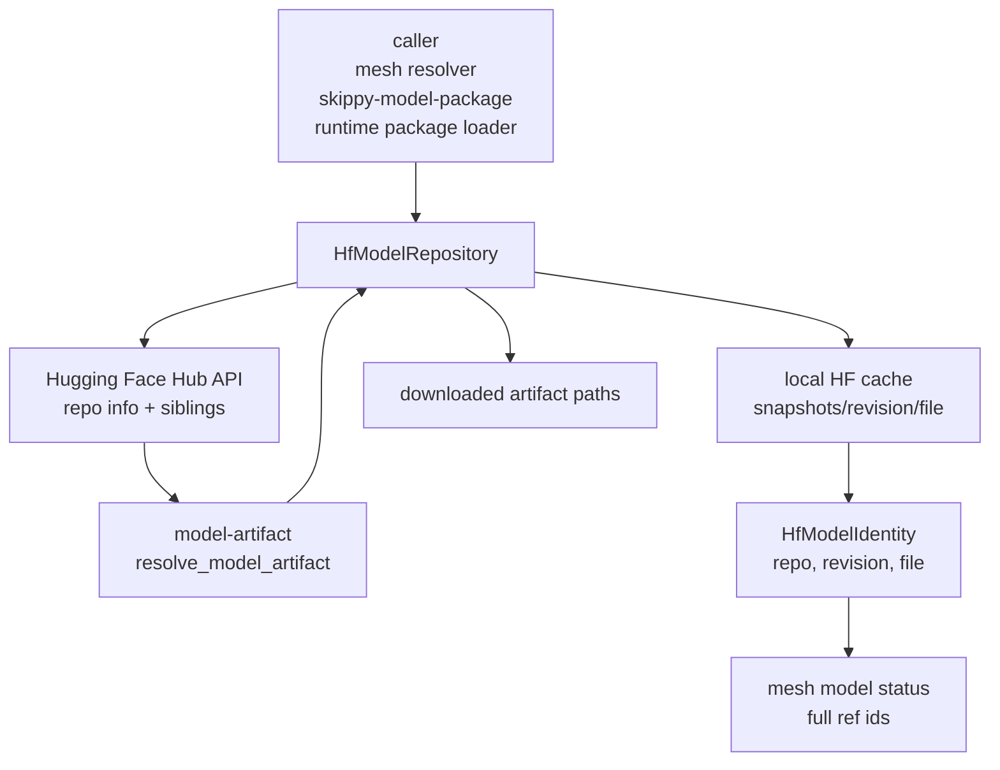

# model-hf

Hugging Face Hub repository and cache adapter for model artifact resolution.

`model-hf` is the concrete `model-artifact::ModelRepository` implementation
backed by the `huggingface-hub` Rust client. It resolves revisions, lists model
repo files, downloads selected artifacts, and recognizes model identity from
paths inside the local Hugging Face cache.

## Architecture Role

The pure identity and selection crates stay registry-agnostic. This crate owns
the Hugging Face edge: endpoint, token, cache layout, repo metadata, downloads,
and cache path identity recovery.



## Configuration

`HfModelRepository::from_env()` follows the usual Hugging Face environment:

```text
HF_ENDPOINT
HF_TOKEN
HUGGING_FACE_HUB_TOKEN
HF_HUB_CACHE
HUGGINGFACE_HUB_CACHE
HF_HOME
HF_XET_CACHE
XDG_CACHE_HOME
MESH_LLM_DATA_DIR
```

The shipped `mesh-llm` binary validates both the Hub destination and Xet's
independent working cache before it starts worker threads. If either configured
path is read-only, it selects a writable directory under the platform-local
mesh-llm data directory (falling back to `~/.mesh-llm/data` or the system temp
directory) and prints the rejected path, operating-system error, and selected
replacement. `MESH_LLM_DATA_DIR` overrides the application-data fallback root.

Use `HfModelRepository::builder()` to override the cache directory, endpoint, or
token explicitly in tests and embedding applications.

## TLS portability

Before constructing a Hub or Xet client, this crate checks the native AArch64
SHA-512 capability. On Linux/Android it reads `AT_HWCAP`; on Apple platforms it
uses the ARM SHA-512 sysctl. If an application provider is already installed,
it keeps that provider. Otherwise, it installs rustls' `ring` provider on
AArch64 without SHA-512 and leaves reqwest's normal provider selection
unchanged everywhere else. If another provider was already installed on an
affected AArch64 CPU, the crate preserves it but warns that its safety cannot
be verified. Xet remains enabled and TLS certificate/hostname verification is
unchanged.

## Responsibilities

- resolve branch/tag names to immutable Hugging Face revisions
- list model repository files at a resolved revision
- download the selected artifact file set
- locate the default Hugging Face cache directory
- derive `HfModelIdentity` and `ModelIdentity` from cached snapshot paths

Keep artifact ranking in `model-artifact`, public reference parsing in
`model-ref`, and stage materialization in `skippy-runtime` or
`skippy-model-package`.

If a path is inside the Hugging Face cache, this crate recovers the repo,
revision, and selected file so mesh can continue advertising the full model ref
instead of a GGUF basename.
