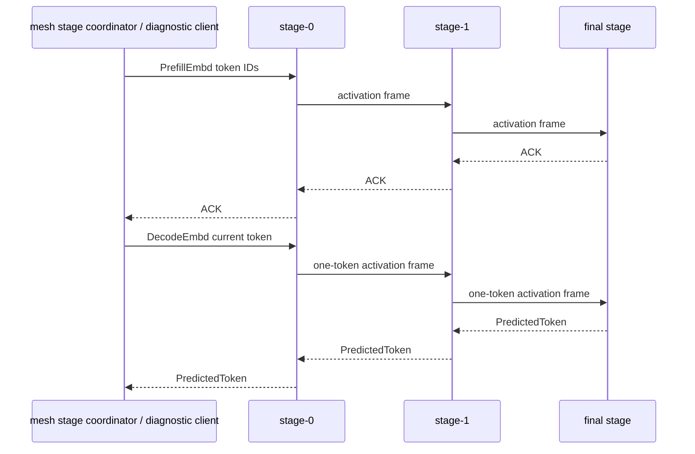

# skippy-protocol

Versioned protocol types for staged execution.

This crate owns wire-compatible message, reply, activation, and state-header
encoding. It should remain independent of server process lifecycle and llama ABI
bindings.

## Architecture Role

`skippy-protocol` is the binary contract for Skippy stage control, artifact
transfer, and activation transport. Mesh owns admission, subprotocol discovery,
connectivity, and stream muxing; Skippy owns the protobuf schema and semantics.
Control and artifact frames are carried through the mesh `STREAM_SUBPROTOCOL`
envelope, while activation transport remains on `skippy-stage/2` between
neighboring stage servers.



Activation payloads dominate the wire path. Protocol generation 5 fixes every
activation frame to raw little-endian `f32`; there is no negotiated or
per-request activation dtype.

## Responsibilities

- binary stage message and reply codecs
- fixed-f32 activation framing
- ready handshake encoding
- stage config fields that must survive JSON generation, including K/V cache
  type strings consumed by the runtime layer
- protocol compatibility constants

Because skippy is new inside mesh, this protocol can evolve independently from
the stable mixed-version mesh protocol. Keep changes explicit and versioned so
stage nodes fail closed instead of corrupting an active topology.

Run protocol tests with:

```bash
cargo test -p skippy-protocol
```
