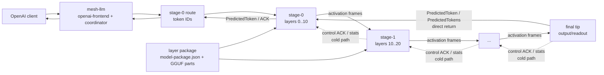
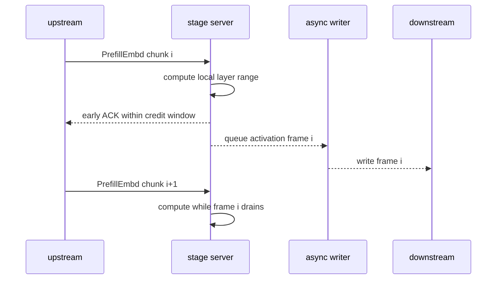
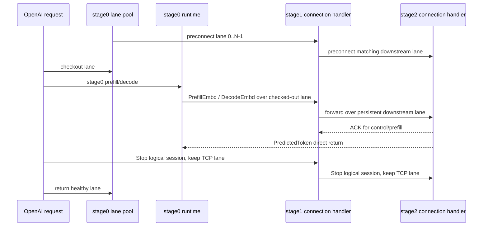

# skippy-server

Production stage service and embeddable staged runtime crate.

`skippy-server` owns stage config, readiness, transport, runtime calls, and
non-blocking telemetry emission. The CLI commands are wrappers around Rust
entry points so mesh can host the same runtime in-process.

## Architecture Role

Each embedded server or server process owns one contiguous layer range. Mesh
plans peers and layer ranges, sends `LoadStage` downstream-to-upstream, waits
for readiness, and then publishes the stage-0 route. OpenAI clients talk to
mesh/openai-frontend; diagnostic and benchmark clients may connect directly to
the first stage.

The full request/reply path is tip-to-tip: token IDs enter at the driver-facing
tip, and activations flow through the stage chain. Stage protocol generation 3
is a compatibility-breaking contract: prediction-bearing replies return
directly from the final/readout tip to the driver-facing stage instead of being
relayed back through intermediate stages. Middle-out is the prefill optimization
inside that path, where internal boundary activations are handed downstream
while local compute advances.



Stage configs bind `stage_id`, `stage_index`, `layer_start`, `layer_end`,
`model_path`, `upstream`, `downstream`, optional K/V cache type settings, and
runtime settings into one loaded stage. Model execution flows through
`skippy-runtime` and the staged llama.cpp ABI.

## Commands

```bash
skippy-server example-config
skippy-server serve --config stage.json
skippy-server serve-binary --config stage.json --activation-width 576
skippy-server serve-openai --config stage.json --bind-addr 127.0.0.1:9337
skippy-server serve-binary --config stage-0.json --topology topology.json --activation-width 576 --openai-bind-addr 127.0.0.1:9337 --generation-concurrency 1
```

## Embedding API

Mesh should use the `embedded` module instead of shelling out to the CLI:

- `SkippyRuntimeHandle::load(...)` loads a stage runtime from Rust-owned
  `StageConfig` / `StageTopology` values and exposes status, telemetry,
  session stats, and explicit shutdown.
- `start_stage_http(...)`, `start_binary_stage(...)`, and
  `start_embedded_openai(...)` start managed servers and return
  `EmbeddedServerHandle` values with status and graceful shutdown.
- `StageHttpOptions`, `BinaryStageOptions`, and `EmbeddedOpenAiArgs` are the
  host-friendly equivalents of the old CLI argument structs. CLI commands now
  convert into these options and call the same serving functions.

The intended mesh ownership model is: mesh resolves models, chooses devices and
topology, builds the stage configs, loads/starts handles, watches readiness and
status, withdraws routes before shutdown, and then calls handle shutdown during
unload or replan.

## Notes

- `serve-binary` is the tuned binary stage-to-stage path.
- `serve-binary` participates in the breaking generation-3 stage protocol.
  Stage compatibility requires `stage-generation-3`; direct prediction return is
  part of that generation's contract, so older chained-reply peers are rejected
  during split planning instead of being mixed into a generation-3 topology.
- `serve-binary` accepts upstream protocol connections concurrently. Model
  execution remains serialized by the per-process runtime lock, but readiness,
  abandoned, or broken connections do not monopolize the listener and block the
  next OpenAI-driven request from reaching the downstream chain.
- Non-final `serve-binary` stages prefer the OS-selected route for downstream
  sockets, then validate that the local socket address matches the
  non-unspecified IP in `bind_addr`. If that route-selected path fails, the
  server falls back through explicit source/interface binding, including the
  macOS interface-scoped socket option. In a multi-NIC lab, set `bind_addr` to
  the private LAN address, such as `192.168.0.x:19031`, so both inbound serving
  and outbound stage-to-stage traffic are pinned to that interface.
- `serve-openai` exposes `/v1/models`, `/v1/chat/completions`, and
  `/v1/completions` using the shared `openai-frontend` crate for a local
  final/single-stage config with no downstream peer. Split serving uses
  embedded stage-0 OpenAI serving from `serve-binary --openai-bind-addr` because
  generation-3 prediction returns flow directly from the final stage to stage 0.
  The older standalone `serve-openai --first-stage-addr` adapter is no longer
  supported. `--model-id` is the exact served model id to advertise
  and accept, for example `org/repo:Q4_K_M`; it is not parsed as stage topology.
  `--generation-concurrency` controls how many chat generation requests may run
  at once; keep it explicit in benchmark reports because it can serialize or
  expose concurrent stage-chain behavior.
- `serve-openai` and embedded stage-0 OpenAI serving emit OpenAI-surface
  telemetry when `--metrics-otlp-grpc` and `--telemetry-level debug` are set.
  The spans account for the full request path visible to the backend:
  HTTP request, request summary, chat template or prompt preparation, generation
  admission, tokenization, downstream connection, prefill, decode,
  detokenization/text emission, generation summary, and response assembly.
  Embedded stage-0 spans also break prefill/decode into local stage-0 compute,
  downstream write, and downstream wait so benchmark reports can reconcile
  OpenAI request latency with the binary stage spans. Decode also emits
  per-token `stage.openai_decode_token` spans with a `cold`, `warmup`, or
  `steady` token phase so reports can separate first-token effects from steady
  TPOT. Runtime scheduling attributes on OpenAI and binary spans include
  `runtime_lock_wait_ms`, `runtime_lock_hold_ms`, `runtime_lock_acquires`, and
  session-pool counts before/after execution so concurrent-depth runs can
  separate useful compute, model-lock wait, and non-runtime overhead.
- Stage configs accept `cache_type_k` and `cache_type_v`, defaulting to `f16`.
  Mesh carries runtime-supported cache types such as `f16` and `q8_0`; the
  experimental TCQ/TurboQuant cache lane is documented as benchmark evidence
  but is not built into this tree.
- Embedded stage-0 OpenAI serving preconnects a persistent downstream lane pool
  sized to `--openai-generation-concurrency`. Each request leases one live
  stage0-to-stage1 stream for its full prefill/decode/stop sequence, then
  returns it to the pool; non-final binary stages keep their matching
  downstream streams open for the lifetime of that lane. `Stop` resets the
  logical session on a lane and leaves the TCP stream open. A failed lane is
  retired and replaced.
- `--openai-prefill-chunk-policy` selects fixed, scheduled, or adaptive stage0
  prefill chunking without changing the default fixed
  `--openai-prefill-chunk-size`. Passing `--openai-prefill-chunk-schedule`
  keeps the legacy schedule behavior, for example `128,256,384` uses `128` for
  the first prefill chunk, `256` for the second, and repeats `384` afterward.
  `adaptive-ramp` starts at `--openai-prefill-adaptive-start`, grows by
  `--openai-prefill-adaptive-step` up to `--openai-prefill-adaptive-max` when
  downstream wait is hidden under stage0 compute/write, and backs off when
  downstream wait is exposed. Prefill spans record the selected policy,
  schedule/adaptive knobs, and min/max observed chunk sizes so reports can
  compare fixed, scheduled, and adaptive runs.
- Embedded stage-0 OpenAI serving can run neural draft speculative decoding with
  `--openai-draft-model-path`, `--openai-speculative-window`, and
  `--openai-adaptive-speculative-window`. The draft model runs locally in the
  stage0 process as a complete model without stage tensor filtering, and
  proposal windows are verified through the existing staged `VerifySpan` binary
  request, so acceptance, rejection, checkpoint, restore, draft-propose, and
  recovery costs are visible on OpenAI-path spans. The draft runner is
  single-session guarded; use this first as a depth-1 measurement knob before
  promoting it for concurrent serving.
- Benchy usage lives in [`docs/skippy/LLAMA_BENCHY.md`](../../docs/skippy/LLAMA_BENCHY.md).
- The local OpenAI smoke harness is `scripts/openai-smoke.sh`.
- `serve-binary` forwards eligible non-final prefill activation frames on a
  bounded background writer by default. Use `--no-async-prefill-forward` only
  when comparing against the synchronous prefill path.
- `runtime-slice` loads a full model and filters tensors at runtime.
- `artifact-slice` loads GGUF slice artifacts written by `skippy-model-package`
  with `filter_tensors_on_load=true`.
- `layer-package` loads a local `model-package.json` directory, validates the
  manifest and selected part files, then opens those GGUF parts directly through
  the stage ABI.
- Package selection validates manifest schema, ABI version, selected part sizes,
  duplicate layers, and required layer presence before runtime load.
- If a layer package declares `projectors` with `kind: "mmproj"`, package-backed
  loading uses the first projector unless the stage config supplies an explicit
  `projector_path`.
- `layer-package` also accepts `hf://namespace/repo[:revision]` and caches the
  downloaded package under `SKIPPY_HF_PACKAGE_CACHE` or the default user
  cache directory.
- Direct package loads are intentionally sparse: non-first stages omit
  embeddings, non-final stages omit output tensors, and all stages omit
  non-owned layers.
- Stage telemetry must not block model execution or protocol handling.
- Model execution flows through `skippy-runtime` and the C ABI shim.

## Middle-Out Prefill

During prefill, activation frames are much larger than token/control traffic.
`--prefill-chunk-size` is chosen by the driver, while `serve-binary` enforces
bounded downstream credit with `--max-inflight` and `--reply-credit-limit`.
When `--async-prefill-forward` is enabled, eligible non-final prefill activation
writes run on a bounded background writer so compute for the next chunk can
overlap with transfer of the previous chunk. This is the middle-out path:
boundary activations leave one layer range while the stage keeps computing the
next chunk.



This is topology dependent; use `--no-async-prefill-forward` to benchmark the
synchronous baseline on a target link. The conservative exact default is `f16`;
`q8` should stay per-family/per-split opt-in until a correctness smoke validates
it.

Debug telemetry includes middle-out timing spans:

- `stage.binary_llama_decode` is the local compute window for a binary message.
- `stage.binary_downstream_write` is the actual downstream activation write
  window. In async mode this span is emitted by the background writer, not by
  the enqueueing request thread.
- `stage.binary_message_timing` covers the full message lifecycle and includes
  compute, downstream write, downstream wait, upstream reply, credit, and
  deferred-reply timestamps. It also carries runtime lock wait and session
  counts for the executable message. Activation conversion is reported with
  `input_activation_decode_ms` for wire-to-f32 materialization and
  `activation_encode_ms` for f32-to-wire forwarding so transfer cost can be
  separated from compute and socket write time.
- `stage.binary_session_stop` records logical session reset timing when a
  persistent lane receives `Stop`; the TCP stream remains open after the reset.
- Stage-to-stage `TcpStream`s set `TCP_NODELAY` on accepted upstream sockets and
  downstream connections. Binary writes call `write_all` directly on the stream
  rather than a buffered writer, so per-token decode is not intentionally
  waiting on user-space flush batching.

Use these spans to compare stage0, stage1, and stage2 timelines directly. The
middle-out health check is whether stage2 prefill compute begins while stage1
is still computing later prefill chunks, and whether downstream write/wait tail
stays small after upstream compute ends.

## Persistent OpenAI Stage Lanes

Embedded stage-0 OpenAI serving keeps stage-chain TCP streams connected before
customer requests arrive. The pool size is the OpenAI generation concurrency, so
a depth-`N` benchmark can lease up to `N` independent stage-chain lanes without
paying downstream TCP setup on the request hot path.



Telemetry keeps the old `stage.openai_downstream_connect` span name for
per-request lane checkout timing, and adds pool/lane lifecycle spans:

- `stage.openai_downstream_persistent_connect`
- `stage.openai_downstream_pool_ready`
- `stage.openai_downstream_lane_replaced`
- `stage.openai_downstream_lane_replace_failed`
