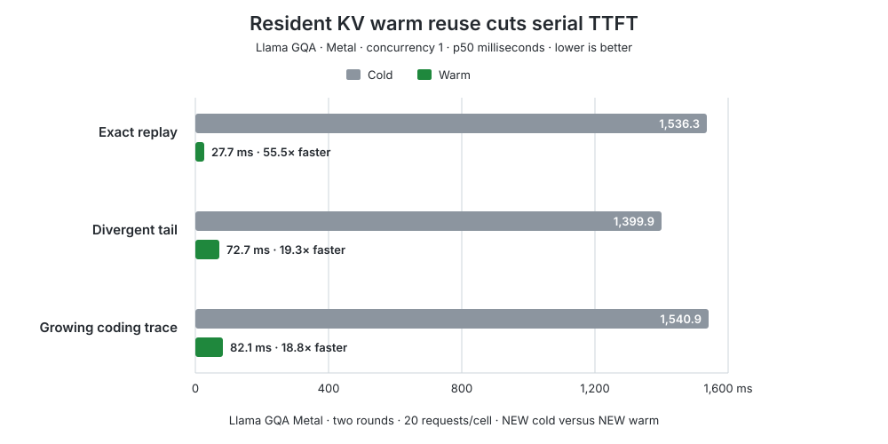
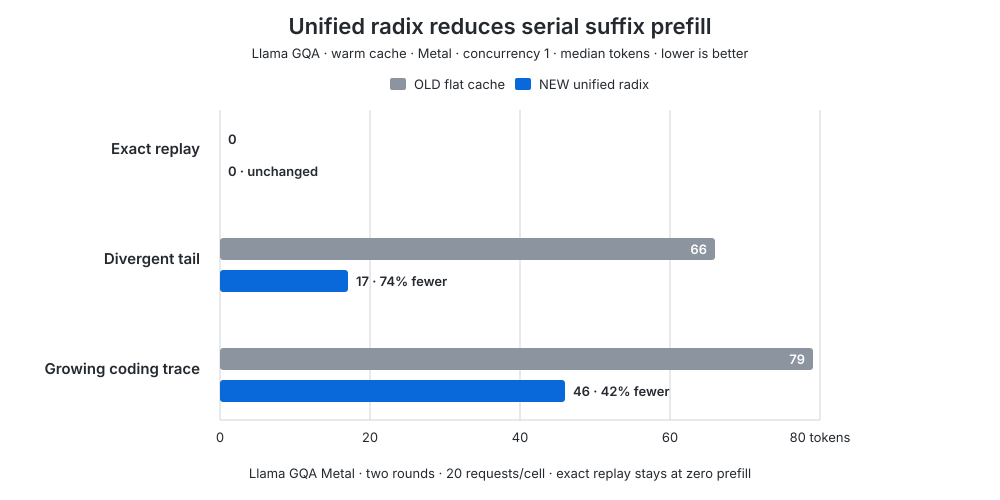

# Skippy Unified Radix Cache

Status: implementation in progress. This design is stacked on the scheduler
cutover in PR #1420 at `3c0f43d4d53361fcdd9eee849824e9392bab522a`.

## Outcome

Skippy will use one namespace-aware compressed token radix tree for production
prefix reuse. A logical node may own a `ResidentKv` payload, a `KvRecurrent`
checkpoint, or both. With this change the radix implementation becomes the only
production prefix index; the current sparse record ladder and flat page-id maps
are removed rather than kept as a fallback.

This PR is the device/in-process cache layer. File-backed L3 storage is a
separate follow-on stacked on stable radix node and payload semantics.

## Current serving boundary

The PR #1420 baseline `skippy-server`:

1. uses `PrefixCandidatePolicy` to enumerate a sparse list of token lengths;
2. hashes each candidate into a `page_id`;
3. scans `ResidentPrefixCache` or `ExactStateCache`, each backed by its own flat
   map; and
4. performs native restore, copy, import, export, and drop operations outside
   `skippy-cache`.

The replacement preserves that crate boundary. `skippy-cache` stays pure and
owns logical matching, node splits, references, recency, accounting, pruning,
and eviction choice. `skippy-server` remains the adapter that mutates native
runtime state and emits telemetry.

## Logical shape

```text
cache namespace
  └─ compressed token edge
       ├─ ResidentKv component: native resident sequence/page handle
       ├─ KvRecurrent component: exact KV + recurrent checkpoint
       └─ child token edges
```

The namespace contains every non-token identity dimension already covered by
the current prefix hash: model weights/revision, tokenizer and chat template,
stage and layer range, runtime ABI, cache layout/dtype/backend/platform,
position configuration, tenant/cache salt, and token start. Token ids remain
the radix path and are never replaced by a short hash.

## Component rules

### ResidentKv

- Any stored node on the request path is a valid exact prefix candidate.
- Native KV pages remain resident in the live runtime.
- Active references protect the node from eviction.
- Branching copies or shares the stored prefix into a request sequence through
  the native sequence-copy primitive; mutation after the branch point belongs
  only to the request sequence.
- Capacity is charged in native KV cells/tokens and estimated bytes.

Resident-KV admission uses the runtime's unified KV-cell ceiling rather than
the cache's entry limit alone. The planner accounts separately for active
session tokens, referenced (pinned) resident prefixes, and unreferenced
prefixes. It rejects only when active + pinned + request + the minimum decode
watermark cannot fit after every releasable prefix is removed. Otherwise it
evicts until a larger healthy watermark is reached, ranking candidates by
predicted recomputation work per released token, recency, total work, and
stable identity. The current resident estimate is cached tokens times a
stage-local layer count that is constant for every entry, so density ties and
recency is the effective production policy. This is cold-first LRU, not a
measured cost-aware policy. Stage timing calibration can replace that uniform
proxy without changing the generic planner contract.

Native sequence deletion precedes exact radix removal for every selected
victim. A failed native drop therefore leaves the logical cache owner and its
sequence-id allocation intact. Capacity decisions report active, pinned,
requested, minimum/target/projected-free, deficit, victim, and predicted-cost
fields through `stage.openai_kv_capacity_decision` telemetry.

Hard admission runs before request-session creation or prefix restoration.
Rejected requests therefore do not change active-token accounting and can be
retried after pressure clears. Decode-batch maintenance falls back to the
legacy best-effort eviction pass when the hard planner cannot satisfy its
watermark, so the most pressured state does not silently skip cleanup.

### KvRecurrent

- The tree can share prefix identity and policy with ResidentKv, but recurrent
  state is an exact checkpoint rather than per-token shareable KV pages.
- Restore clones/imports the checkpoint into an active native sequence slot.
- The attention-KV and recurrent/SSM portions are one atomic component: a
  partial component hit is a miss.
- Capacity is charged by physical deduplicated bytes and logical bytes.

## Required invariants

1. Longest-prefix lookup returns only a component on a fully matched token path.
2. Namespace mismatch is always a miss, even for identical tokens.
3. Splitting a compressed edge preserves payload ownership and descendants.
4. A node can hold both component types without duplicate token topology.
5. Active references cannot be evicted; release is balanced and underflow-safe.
6. Evicting one component does not delete another component at the same node.
7. Empty nodes are pruned and unary payload-free nodes are recompressed.
8. Resident and recurrent budgets and victims are component-aware.
9. Native mutation failure never commits a logical payload; native drop failure
   never silently removes its logical owner.
10. Telemetry reports namespace-safe hit kind, matched tokens, suffix prefill,
    node/component counts, active references, bytes/cells, splits, and evictions.

## Implementation sequence

1. Add the pure compressed radix topology and invariant tests to
   `skippy-cache`.
2. Expose a stable non-token namespace identity and pass full token slices from
   the existing text and binary serving call sites.
3. Move ResidentKv metadata and eviction into the unified tree, then verify
   native copy/drop rollback.
4. Move KvRecurrent checkpoint metadata and deduped payload ownership into the
   same tree.
5. Remove `PrefixCandidatePolicy` record-ladder lookup/record behavior and the
   two flat prefix maps from production serving.
6. Add metrics and documentation, then run the complete gates below.

## Verification and benchmark contract

Pure tests cover every invariant above plus randomized insert/lookup/remove
sequences checked against a simple reference map. Server tests cover native
copy/import/drop failure rollback, cancellation, concurrent lookup/record,
preemption, and eviction under a real unified-KV deficit.

The OLD baseline is exact PR #1420 behavior. The NEW candidate is the radix
branch. Both use matched release binaries, models, prompts, token budgets,
contexts, lanes, and sampling on the same machine with alternating run order.

The final cache A/B uses one representative for each physical payload class:
Llama GQA for `ResidentKv` and Qwen3.5 hybrid for `KvRecurrent`. It covers cold
and warm exact replay, divergent tails, and a growing coding-agent trace at
serial and concurrent load. The tree treats these components as opaque
payloads, so additional model families and repeated rounds primarily broaden
runtime-family coverage and reduce timing variance rather than exercise a
third radix implementation.

Cross-family graph, tensor-layout, dtype, parity, and hybrid-boundary coverage
is supplied separately by the policy-driven family battery in
[PR #1436](https://github.com/Mesh-LLM/mesh-llm/pull/1436). Its checked-in
policy currently certifies 32 pinned dense, MLA, MoE, hybrid, and recurrent
family artifacts; hybrid/recurrent rows sweep planner cut offsets
so first-layer-only detection defects cannot hide. That battery complements the
cache-specific OLD/NEW measurements here rather than replacing them.

Acceptance requires successful requests, correct output preservation, exact
replay hits for both payload classes, divergent/growing reuse for `ResidentKv`,
concurrent reader/refcount safety, and no suspect server or telemetry failures.
Atomic `KvRecurrent` checkpoints are expected to miss divergent/growing prompts
unless explicit message-boundary checkpoints are recorded.

### Model-backed closeout charts





Both charts use the two-round Llama GQA Metal certificate at concurrency 1
(20 measured requests per cell). Serial cells isolate cache behavior from
concurrent accelerator scheduling variance. The exact-head Qwen3.5 recurrent
certificate is correctness evidence and is intentionally not used for a
single-round performance chart.

## Follow-on: file-backed L3

The second stacked PR adds versioned, content-addressed file objects, atomic
publish, integrity verification, quota/eviction, async backup/load, restart
recovery, and explicit write/prefetch policies behind the component interface.
It benchmarks L1 hits, file-L3 hits, and true cold recompute separately. The
file format must not prevent a later host-memory L2 or remote storage backend.
