# Mixed prefill/decode Studio54 A/B

PR #1456 was measured on Studio54 against exact stacked base and candidate
binaries. The result is a safety boundary, not evidence of a general
performance improvement: mixed scheduling remains available for non-recurrent
models, while recurrent models stay phase-homogeneous.

## Exact inputs

- Machine: Studio54, Apple M1 Ultra, 128 GB unified memory.
- Model: `Qwen3.5-0.8B-UD-Q8_K_XL.gguf`, SHA-256
  `167183aecc0735359970e977c21a88c7d69112be06aa5d2df27c0d2a23662805`.
- Base: `4229aafd5180efc010c0b3cf2baaa808d86cde52` (#1453).
- Candidate: `f28a73ac3992a0bf87e3af270716f42ffbebc81c` (#1456).
- Base server SHA-256:
  `b579b1b95491c412602dd621654a3a41390f04f50facb001c4c22a80da90238f`.
- Candidate server SHA-256:
  `ec124a1af445168a13a33cead20254b78b84be35ee8779b7d6d11a184cd972aa`.
- Each trace ran base/candidate/candidate/base so both arms occupied the early
  and late positions.
- Every measured request succeeded. EOS token `248046` was suppressed through
  the supported logit-bias field, yielding 640 completion tokens per
  representative pass and 768 per stress pass in both arms.
- Representative: `n_batch=1024`, `n_ubatch=256`, 12 lanes, four decode
  anchors, and eight staggered prefills.
- Stress: `n_batch=256`, `n_ubatch=128`, 12 lanes, four longer decode anchors,
  and eight long staggered prefills.
- All eight final server logs contained zero invalid-logits, panic, error,
  failure, or unsupported-path diagnostics.

## Why recurrent mixing is disabled

The pre-guard exact candidate `59f92fb60b7d2e45c3c2a6d14fc1f2eef6b6b5f1`
admitted one mixed probe per pass. On the stress trace, average makespan rose
from 6,649.3 ms to 7,532.0 ms and output throughput fell 12.1%. The mixed call
itself took only 59-86 ms, but later decode-only iterations averaged 9-20%
longer than the paired base. Falling back after the probe therefore could not
undo the regression.

The final candidate enables mixed prefill/decode only when the model reports no
recurrent-state allocation. Qwen3.5 is recurrent, so all final candidate passes
recorded zero mixed iterations and retained the phase-homogeneous schedule.

## Final two-pass means

Lower is better for makespan, TTFT, and inter-stream-chunk latency. Higher is
better for throughput.

| Trace | Metric | Base | Candidate | Change |
|---|---|---:|---:|---:|
| Representative | Makespan | 4,328.0 ms | 4,370.5 ms | 1.0% higher |
| Representative | Completion throughput | 147.875 tok/s | 146.436 tok/s | 1.0% lower |
| Representative | p50 TTFT | 391.4 ms | 471.4 ms | 20.4% higher |
| Representative | p95 TTFT | 1,209.3 ms | 1,324.3 ms | 9.5% higher |
| Representative | p95 inter-stream-chunk | 232.5 ms | 201.6 ms | 13.3% lower |
| Representative | Scheduler iterations | 127.0 | 127.0 | unchanged |
| Representative | Mixed iterations | 0.0 | 0.0 | unchanged |
| Stress | Makespan | 6,141.3 ms | 6,143.1 ms | effectively unchanged |
| Stress | Completion throughput | 125.062 tok/s | 125.020 tok/s | effectively unchanged |
| Stress | p50 TTFT | 1,134.0 ms | 1,227.4 ms | 8.2% higher |
| Stress | p95 TTFT | 3,638.2 ms | 3,605.7 ms | 0.9% lower |
| Stress | p95 inter-stream-chunk | 179.2 ms | 188.2 ms | 5.0% higher |
| Stress | Scheduler iterations | 236.0 | 236.5 | effectively unchanged |
| Stress | Mixed iterations | 0.0 | 0.0 | unchanged |

```mermaid
xychart-beta
    title "Final representative trace (base = 100)"
    x-axis [Makespan, Throughput, p50-TTFT, p95-TTFT, p95-gap, Iterations]
    y-axis "Percent of base" 0 --> 130
    bar [100, 100, 100, 100, 100, 100]
    bar [101.0, 99.0, 120.4, 109.5, 86.7, 100.0]
```

```mermaid
xychart-beta
    title "Final stress trace (base = 100)"
    x-axis [Makespan, Throughput, p50-TTFT, p95-TTFT, p95-gap, Iterations]
    y-axis "Percent of base" 0 --> 115
    bar [100, 100, 100, 100, 100, 100]
    bar [100.0, 100.0, 108.2, 99.1, 105.0, 100.2]
```

## Interpretation

The indexed-output fix is correctness-valid: the model-backed mixed-versus-
serial parity test passes, all fixed-length generations complete, and native
diagnostics remain clean. The final recurrent guard removes the material stress
regression, but the remaining representative latency variation means this A/B
still does not support a speedup claim.

PR #1456 should be reviewed as a correctness-safe mixed-execution capability
with an explicit recurrent-model exclusion. A performance claim requires a
separate exact-head certificate on a non-recurrent model where mixed execution
is actually admitted.

The exact per-pass metrics are versioned in
[`mixed-prefill-decode-studio54-summary.json`](mixed-prefill-decode-studio54-summary.json).
