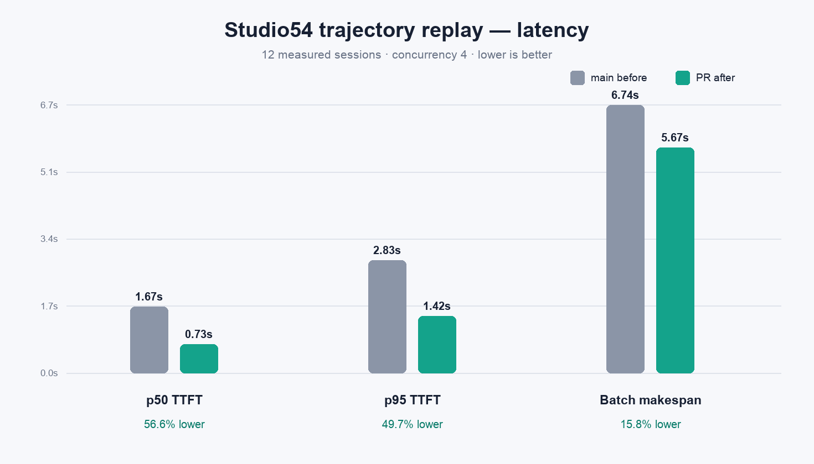
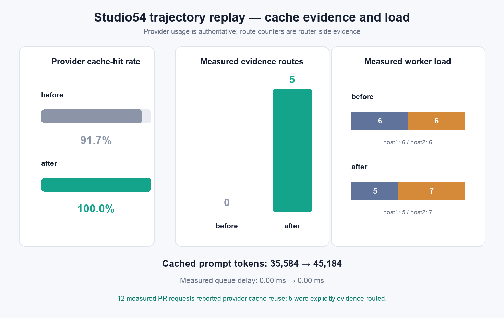

# Distributed radix-affinity Studio54 replay

PR #1449 was exercised on Studio54 against a deterministic sample from
`thoughtworks/agentic-coding-trajectories`. The replay validates the production
distributed-ingress path with two serving hosts and two passive clients. It is a
small-model integration result, not a production-capacity claim.

This table supersedes the earlier interim channel figures (including the
0.94–0.98 second p50 and 1.56 second p95 candidate observations). Those figures
were from pre-final runs; the versioned values below are the final replay used
for review.

## Result

| Measured metric | `main` (`4c978666`) | PR code (`f25e2697`) | Change |
|---|---:|---:|---:|
| p50 time to first token | 1,672.8 ms | 725.8 ms | 56.6% lower |
| p95 time to first token | 2,833.6 ms | 1,424.8 ms | 49.7% lower |
| 12-request makespan | 6,737.0 ms | 5,669.3 ms | 15.8% lower |
| Provider-reported cached prompt tokens | 35,584 | 45,184 | 27.0% higher |
| Provider-reported cache-hit requests | 11/12 | 12/12 | +1 request |
| Explicit cache-evidence routes | 0/12 | 5/12 | +5 routes |
| Stale evidence fallbacks | 0 | 0 | unchanged |
| Measured worker distribution | 6 / 6 | 5 / 7 | bounded spread |

The derived metrics and pinned inputs are in
[`radix-affinity-studio54-summary.json`](radix-affinity-studio54-summary.json).

## Method

- Machine: Studio54, Apple M1 Ultra, 20 CPU cores, 128 GB unified memory.
- Model: local `Qwen3.5-0.8B-UD-Q8_K_XL.gguf`, exposed as
  `local-gguf/sha256-aaf01a58bf88ada6`.
- Dataset: `thoughtworks/agentic-coding-trajectories`, revision
  `cef72d1f4d0caabf85937adf8337a14b7522c782`; Parquet SHA-256
  `3dd8ec3546cf771ce4ab2ac6c51ccefdd621197fa997a2cefb430b50df808fb6`.
- Sample: 12 deterministic sessions selected with seed 1449, `n_turns >= 3`,
  and `max_isl` between 2,000 and 6,000.
- Replay: three growing checkpoints per session. Two sequential checkpoints
  warmed cache state, followed by a 65-second gossip window and a measured
  checkpoint at concurrency four.
- Each arm started fresh mesh and model processes. The PR arm was rerun at the
  final code commit after review fixes.

The replay was not order-reversed, so run-order and thermal drift remain a
limitation. The raw inputs and measured values are preserved to make that
limitation explicit rather than treating this single pass as a capacity claim.

TTFT is measured at the first streamed content or reasoning delta. Cached prompt
tokens come from the terminal OpenAI usage payload. Router counters are deltas
from the client status API around the measured phase. Worker counts are matched
by deterministic request IDs in host logs.

## Interpretation

Provider and router counters answer different questions. All 12 measured PR
requests reused some provider-side prefix state, while five were explicitly
selected from distributed cache evidence. The status endpoint does not identify
those five request IDs, so the total TTFT improvement cannot be attributed only
to evidence routing.

The baseline learned-affinity counters remained at zero on this distributed
ingress topology because that path did not parse the bounded request body. The
comparison therefore captures current `main` behavior against the fixed PR,
including activation of live cache evidence.

The test uses two model processes on one machine and a 0.8B model. Larger models,
multiple physical workers, network latency, queue pressure, and repeated seeds
remain necessary for production sizing.
